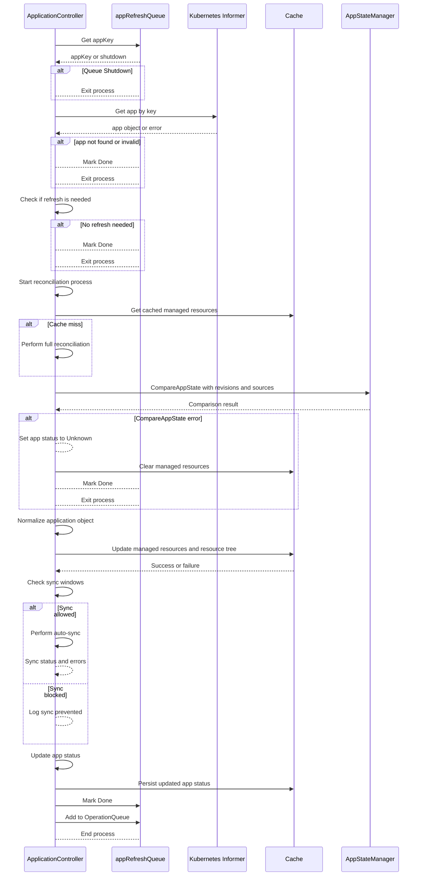
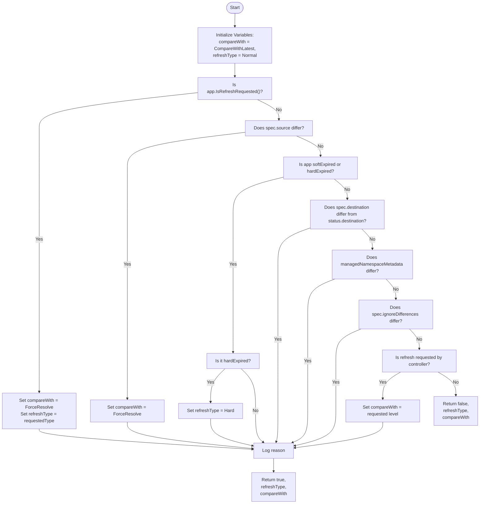

argocd 프로젝트의 기본 구조를 분석해보자.

---

# main 구조

먼저 argocd 프로젝트의 출발지는 cmd/ main.go이다. main함수의 구조는 다음과 같다.

```go
package main

// ...

// https://github.com/argoproj/argo-cd/blob/4f6e4088efc789a8cb44d3e25a444467c46d761f/cmd/main.go#L27
func main() {
	var command *cobra.Command

	// ✅ 현재 실행중인 파일 경로를 인자로 전달: 빌드된 파일 이름이 binary name으로 들어감(이거 그럼 디버깅 어떻게하지)
	binaryName := filepath.Base(os.Args[0])
	if val := os.Getenv(binaryNameEnv); val != "" {
		binaryName = val
	}

	isCLI := false
	// binary 이름에 따라 분기
	switch binaryName {
	// ✅ argocd cli인 경우
	case "argocd", "argocd-linux-amd64", "argocd-darwin-amd64", "argocd-windows-amd64.exe":
		command = cli.NewCommand()
		isCLI = true
	// ✅ argocd server인 경우
	case "argocd-server":
		command = apiserver.NewCommand()
	case "argocd-application-controller":
		command = appcontroller.NewCommand()
	// ...
	}
	util.SetAutoMaxProcs(isCLI) // gmp p setting

	// command 실행
	if err := command.Execute(); err != nil {
		os.Exit(1)
	}
}

```

위의 구조는 되게 심플하게 돌아간다. 실행한 binary이름을 찾고 binary에 맞는 command를 끼고 command를 실행한다. 이 과정에서 cobra라는 라이브러리를 사용한다.

---

# cobra

예를 들어 아래와 같은 코드를 짠 경우,

```go
package main

import (
	"fmt"

	"github.com/spf13/cobra"
)

var name string

var rootCmd = &cobra.Command{
	Use:   "app",                      // 명령어 이름
	Short: "App is a simple CLI tool", // 간단한 설명
	Long: `App is a CLI tool built with Cobra.
This is an example application to demonstrate how Cobra works.`, // 상세 설명
	Run: func(cmd *cobra.Command, args []string) {
		fmt.Println("Hello, Cobra!")
	},
}

var greetCmd = &cobra.Command{
	Use:   "greet",
	Short: "Prints a greeting message",
	Run: func(cmd *cobra.Command, args []string) {
		fmt.Printf("Hello, %s!\n", name)
	},
}

func init() {
	greetCmd.Flags().StringVarP(&name, "name", "n", "World", "Name to greet") // 플래그 추가
	rootCmd.AddCommand(greetCmd)
}

func main() {
	if err := rootCmd.Execute(); err != nil {
		fmt.Println(err)
	}
}

```

이렇게 실행하면

```go
 ./main greet --help
```

이렇게 리턴한다.

```go
Prints a greeting message

Usage:
  app greet [flags]

Flags:
  -h, --help          help for greet
  -n, --name string   Name to greet (default "World")
flangdu@DESKTOP-SPRNMEM:/mnt/c/Users/dx/work-root/pr
```

그냥 cli도구. 중요한 것은 cobra에서 Run 메서드와 cmd를 execute하는 부분을 찾는 것이다.

---

# cli app 생성 동작

cli 코드는 가장 먼저 root.go에서 확인할 수 있다.

```go
// https://github.com/argoproj/argo-cd/blob/master/cmd/argocd/commands/root.go
func NewCommand() *cobra.Command {
	// ...
	command.AddCommand(initialize.InitCommand(NewApplicationCommand(&clientOpts)))
	// ...
	return command
}
```

여기서 함수를 하나씩 읽어보면 딱 봐도 application 관련 커맨드를 등록하는 함수가 보인다. `command.AddCommand(initialize.InitCommand(NewApplicationCommand(&clientOpts)))` 이 시그니처인데, 내부를 들어가보자.

```go
// https://github.com/argoproj/argo-cd/blob/96d0226a4963d9639aea81ec1d3a310fed390133/cmd/argocd/commands/app.go#L65
func NewApplicationCommand(clientOpts *argocdclient.ClientOptions) *cobra.Command {
	command := &cobra.Command{ ... }
	// ...
	command.AddCommand(NewApplicationCreateCommand(clientOpts))
	// ...
	return command
}

```

바로 밑에 함수 정의가 있는데 해당 부분을 확인해보자. 주요 메서드는 결국 Run이다.

```go
// https://github.com/argoproj/argo-cd/blob/96d0226a4963d9639aea81ec1d3a310fed390133/cmd/argocd/commands/app.go#L118
func NewApplicationCreateCommand(clientOpts *argocdclient.ClientOptions) *cobra.Command {
	// 클로저에서 사용할 변수
	var (
		appOpts      cmdutil.AppOptions
		fileURL      string
		appName      string
		upsert       bool
		labels       []string
		annotations  []string
		setFinalizer bool
		appNamespace string
	)
	// ...
	command := &cobra.Command {
		Use: "app", // 명령어 이름 argocd app ~~ 
		// ...
		Run: func(c *cobra.Command, args []string) {
			
		},
	}
	// 사용할 변수 플래깅	
	command.Flags().StringVar(&appName, "name", "", "A name for the app, ignored if a file is set (DEPRECATED)")
	command.Flags().BoolVar(&upsert, "upsert", false, "Allows to override application with the same name even if supplied application spec is different from existing spec")
	command.Flags().StringVarP(&fileURL, "file", "f", "", "Filename or URL to Kubernetes manifests for the app")
	command.Flags().StringArrayVarP(&labels, "label", "l", []string{}, "Labels to apply to the app")
	command.Flags().StringArrayVarP(&annotations, "annotations", "", []string{}, "Set metadata annotations (e.g. example=value)")
	command.Flags().BoolVar(&setFinalizer, "set-finalizer", false, "Sets deletion finalizer on the application, application resources will be cascaded on deletion")
}
```

command가 실행되면 `Run:`  의 필드로 받는 클로저가 실행된다.

```go
// https://github.com/argoproj/argo-cd/blob/96d0226a4963d9639aea81ec1d3a310fed390133/cmd/argocd/commands/app.go#L152
		Use:   "create APPNAME", // 명령어 이름
		// ...
		Run: func(c *cobra.Command, args []string) {
			// argocdClient 생성
			argocdClient := headless.NewClientOrDie(clientOpts, c)
		
			// ...
			// apps을 파일로부터 가져옴: 일단 어디선가 apps을 만들어서 가져옴
			apps, err := cmdutil.ConstructApps(fileURL, appName, labels, annotations, args, appOpts, c.Flags())
			errors.CheckError(err)

			// app을 순회하면서
			for _, app := range apps {
				// ...
				if appNamespace != "" {
					app.Namespace = appNamespace
				}
				if setFinalizer {
					app.Finalizers = append(app.Finalizers, "resources-finalizer.argocd.argoproj.io")
				}
				
				// argoClient에서 applicationClient를 만듦
				// grpc 서버 예상
				// ✅ 여기 함수 시그니처가 특이한데, io.Closer와 applicationClient를 같이 리턴
				conn, appIf := argocdClient.NewApplicationClientOrDie()
				defer argoio.Close(conn)
				
				// 생성 요청 생성
				appCreateRequest := application.ApplicationCreateRequest{
					Application: app,
					Upsert:      &upsert, // upsert 인자 전달
					Validate:    &appOpts.Validate,
				}

				// app 존재 여부 확인
				// Get app before creating to see if it is being updated or no change
				existing, err := appIf.Get(ctx, &application.ApplicationQuery{Name: &app.Name})
				unwrappedError := grpc.UnwrapGRPCStatus(err).Code()
				// As part of the fix for CVE-2022-41354, the API will return Permission Denied when an app does not exist.
				if unwrappedError != codes.NotFound && unwrappedError != codes.PermissionDenied {
					errors.CheckError(err)
				}
			
				// ✅ 생성 전달
				created, err := appIf.Create(ctx, &appCreateRequest)
				errors.CheckError(err)

				// 액션에 따라 application 동작 리턴
				var action string
				if existing == nil {
					action = "created"
				} else if !hasAppChanged(existing, created, upsert) {
					action = "unchanged"
				} else {
					action = "updated"
				}

				fmt.Printf("application '%s' %s\n", created.ObjectMeta.Name, action)
			}
		},

```

그러니까 해당 함수 동작을 요약하면 application 생성 템플릿을 가져와서 appClient를 만들고 생성 요청을 어딘가 전달한다.

먼저 `argocdClient.NewApplicationClientOrDie()` 내부를 보자. 정의로 이동하면 해당 함수를 확인할 수 있다.

```go
// https://github.com/argoproj/argo-cd/blob/96d0226a4963d9639aea81ec1d3a310fed390133/pkg/apiclient/apiclient.go#L686C1-L692C2
func (c *client) NewApplicationClientOrDie() (io.Closer, applicationpkg.ApplicationServiceClient) {
	conn, appIf, err := c.NewApplicationClient()
	if err != nil {
		log.Fatalf("Failed to establish connection to %s: %v", c.ServerAddr, err)
	}
	return conn, appIf
}

// https://github.com/argoproj/argo-cd/blob/96d0226a4963d9639aea81ec1d3a310fed390133/pkg/apiclient/apiclient.go#L668C1-L675C2
func (c *client) NewApplicationClient() (io.Closer, applicationpkg.ApplicationServiceClient, error) {
	conn, closer, err := c.newConn()
	if err != nil {
		return nil, nil, err
	}
	appIf := applicationpkg.NewApplicationServiceClient(conn)
	return closer, appIf, nil
}

// https://github.com/argoproj/argo-cd/blob/96d0226a4963d9639aea81ec1d3a310fed390133/pkg/apiclient/apiclient.go#L489C1-L489C66
func (c *client) newConn() (*grpc.ClientConn, io.Closer, error) {
	// ...
}
```

역시 파고 들어가면 grpc 클라이언트 커넥션을 만드는 부분이 나온다. 이 부분은 깊게 확인하지 않는다. grpc client 연결에 대한 부분은 따로 다루지 않으려고 한다.

참고로 application에 대한 .proto 형식은 여기서 확인 가능하다.

https://github.com/argoproj/argo-cd/blob/master/server/application/application.proto

---

# api server 라이프사이클

cli로 받은 요청은 argocd api server가 처리한다. 따라서 server에 대한 코드를 분석해야 한다. 그럼 다시 cli 실행 부분부터 api server 동작까지 흘러가는 방식으로 진행해보자.

```go
	// ...		
	case "argocd-server":
		command = apiserver.NewCommand()
	// ...
```

`apiserver.NewCommand()` 내부로 들어간다. 내부 구조는 심플하다. cliName에 대응하는 이벤트를 바로 설정하므로 해당 이벤트가 호출된다.

```go
// https://github.com/argoproj/argo-cd/blob/4f6e4088efc789a8cb44d3e25a444467c46d761f/cmd/argocd-server/commands/argocd_server.go#L55
func NewCommand() *cobra.Command {
	// 함수 내부 변수 세팅
	// ...
	command := &cobra.Command{
		Use:               cliName,
		DisableAutoGenTag: true,
		Run: func(c *cobra.Command, args []string) {
			// some logic
			// ...
		}
		// 커맨드 변수 flagging
		// ...
		
	// cache 설정
	tlsConfigCustomizerSrc = tls.AddTLSFlagsToCmd(command)
	cacheSrc = servercache.AddCacheFlagsToCmd(command, cacheutil.Options{
		OnClientCreated: func(client *redis.Client) {
			redisClient = client
		},
	})
	repoServerCacheSrc = reposervercache.AddCacheFlagsToCmd(command, cacheutil.Options{FlagPrefix: "repo-server-"})
	return command
```

중요한 건 Run 내부이므로 해당 함수를 분석해야 한다. **argocd는 서버로 동작하니 이 부분에서 blocking call이 있어야 한다**는 합리적인 의심을 해볼 수 있다.

다음은 Run의 내부이다.

```go
// https://github.com/argoproj/argo-cd/blob/4f6e4088efc789a8cb44d3e25a444467c46d761f/cmd/argocd-server/commands/argocd_server.go#L105
		Run: func(c *cobra.Command, args []string) {
			
			// argocd server 설정
			// ...
			argocd := server.NewServer(ctx, argoCDOpts, appsetOpts) // argocd 생성
			argocd.Init(ctx) // informer 고루틴 실행
			for {
				var closer func()
				serverCtx, cancel := context.WithCancel(ctx)
				lns, err := argocd.Listen() // tcp 서버 열기
				errors.CheckError(err)
				// ...
				argocd.Run(serverCtx, lns) // 서버 실행
				if closer != nil {
					closer()
				}
				cancel()
				if argocd.TerminateRequested() {
					break
				}
			}
		},
```

보통 일반적인 서버 블로킹은 Run같은 메서드가 한다. 위에 딱 의심스러운 argocd.Run이 있다. 이 부분을 더 들어가보자. Run 메서드가 해야 할 작업은 명확하다. 여러 대의 서버 및 mux를 고루틴으로 열고 해당 고루틴의 종료를 감지 & waitgroup 대기하는 것이다.

```go
// https://github.com/argoproj/argo-cd/blob/dfbfdbab1188dfb26b454e47ac06c70ed484c066/server/server.go#L535
func (a *ArgoCDServer) Run(ctx context.Context, listeners *Listeners) {
	// ...
	// http / https mux & grpc server setting
	svcSet := newArgoCDServiceSet(a)
	a.serviceSet = svcSet
	grpcS, appResourceTreeFn := a.newGRPCServer()
	grpcWebS := grpcweb.WrapServer(grpcS)
	var httpS *http.Server
	var httpsS *http.Server
	if a.useTLS() {
		httpS = newRedirectServer(a.ListenPort, a.RootPath)
		httpsS = a.newHTTPServer(ctx, a.ListenPort, grpcWebS, appResourceTreeFn, listeners.GatewayConn, metricsServ)
	} else {
		httpS = a.newHTTPServer(ctx, a.ListenPort, grpcWebS, appResourceTreeFn, listeners.GatewayConn, metricsServ)
	}
	// ...

	// goroutine으로 서버 호스팅 및 에러 감지
	go func() { a.checkServeErr("grpcS", grpcS.Serve(grpcL)) }()
	go func() { a.checkServeErr("httpS", httpS.Serve(httpL)) }()
	if a.useTLS() {
		go func() { a.checkServeErr("httpsS", httpsS.Serve(httpsL)) }()
		go func() { a.checkServeErr("tlsm", tlsm.Serve()) }()
	}
	go a.watchSettings()
	go a.rbacPolicyLoader(ctx)
	go func() { a.checkServeErr("tcpm", tcpm.Serve()) }()
	go func() { a.checkServeErr("metrics", metricsServ.Serve(listeners.Metrics)) }()
	if !cache.WaitForCacheSync(ctx.Done(), a.projInformer.HasSynced, a.appInformer.HasSynced) {
		log.Fatal("Timed out waiting for project cache to sync")
	}

	// 종료 시점 컬백함수 호출
	shutdownFunc := func() {
		// ...
		var wg gosync.WaitGroup

		// Shutdown http server
		wg.Add(1)
		go func() {
			defer wg.Done()
			err := httpS.Shutdown(shutdownCtx)
			// ...
		}()

		if a.useTLS() {
			// Shutdown https server
			wg.Add(1)
			go func() {
				defer wg.Done()
				err := httpsS.Shutdown(shutdownCtx)
				// ...
			}()
		}

		// Shutdown gRPC server
		wg.Add(1)
		go func() {
			defer wg.Done()
			grpcS.GracefulStop()
		}()

		// Shutdown metrics server
		wg.Add(1)
		go func() {
			defer wg.Done()
			err := metricsServ.Shutdown(shutdownCtx)
			// ...
		}()

		if a.useTLS() {
			// Shutdown tls server
			wg.Add(1)
			go func() {
				defer wg.Done()
				tlsm.Close()
			}()
		}

		// Shutdown tcp server
		wg.Add(1)
		go func() {
			defer wg.Done()
			tcpm.Close()
		}()

		c := make(chan struct{})
		// This goroutine will wait for all servers to conclude the shutdown
		// process
		go func() { // 모든 서버 종료 이벤트 수신 시 채널 닫기
			defer close(c)
			wg.Wait()
		}()

		// 채널 닫힐 때까지 대기
		select {
		case <-c:
			log.Info("All servers were gracefully shutdown. Exiting...")
		// ...
		}
	}
	
	// 시그널 등록
	a.shutdown = shutdownFunc
	signal.Notify(a.stopCh, os.Interrupt, syscall.SIGINT, syscall.SIGTERM)
	a.available.Store(true)

	// 종료 대기
	select {
	case signal := <-a.stopCh:
		log.Infof("API Server received signal: %s", signal.String())
		// SIGUSR1 is used for triggering a server restart
		if signal != syscall.SIGUSR1 {
			a.terminateRequested.Store(true)
		}
		a.shutdown()
	case <-ctx.Done():
		log.Infof("API Server: %s", ctx.Err())
		a.terminateRequested.Store(true)
		a.shutdown()
	}
}

```

서버 실행을 다시 한 번 살펴보자. 서버에 대한 라이프사이클은 다음 로직을 따른다.

1. cli실행
2. 실행하면 server 생성 → tcp 서버 열기 → 서버 실행 과정으로 동작
3. 서버 실행
4. 종료 call이 떨어지면 waitgroup을 통해 올바르게 종료하는지 확인
5. 모든 서버가 종료되기를 대기하고 채널 수신 후 프로세스 종료

---

# grpc 요청 동작

그렇지만 서버 라이프사이클은 크게 중요하지 않다. 중요한 건 어떻게 요청이 처리되는가이다. 이를 확인하려면 grpcServer에 어떻게 구현한 rpc가 등록되는지 찾아야 한다.

다시 Run 메서드를 확인해보자.

```go
// https://github.com/argoproj/argo-cd/blob/dfbfdbab1188dfb26b454e47ac06c70ed484c066/server/server.go#L535
func (a *ArgoCDServer) Run(ctx context.Context, listeners *Listeners) {
	// ...
	// http / https mux & grpc server setting
	grpcS, appResourceTreeFn := a.newGRPCServer()
	// ...
```

여기서 `a.newGRPCServer()` 가 호출된다. 이 내부를 들어가자. 내부에는 grpc 서버가 생성되고 다양한 서비스가 서버에 등록되는 것을 확인할 수 있다.

```go
// https://github.com/argoproj/argo-cd/blob/dfbfdbab1188dfb26b454e47ac06c70ed484c066/server/server.go#L876C1-L876C87
func (a *ArgoCDServer) newGRPCServer() (*grpc.Server, application.AppResourceTreeFn) {
	// ...
	// grpc 서버 생성
	grpcS := grpc.NewServer(sOpts...)
	
	// grpc 서버에 service 레지스터
	versionpkg.RegisterVersionServiceServer(grpcS, a.serviceSet.VersionService)
	clusterpkg.RegisterClusterServiceServer(grpcS, a.serviceSet.ClusterService)
	applicationpkg.RegisterApplicationServiceServer(grpcS, a.serviceSet.ApplicationService) // application service 등록은 여기에 존재
	applicationsetpkg.RegisterApplicationSetServiceServer(grpcS, a.serviceSet.ApplicationSetService)
	notificationpkg.RegisterNotificationServiceServer(grpcS, a.serviceSet.NotificationService)
	repositorypkg.RegisterRepositoryServiceServer(grpcS, a.serviceSet.RepoService)
	repocredspkg.RegisterRepoCredsServiceServer(grpcS, a.serviceSet.RepoCredsService)
	sessionpkg.RegisterSessionServiceServer(grpcS, a.serviceSet.SessionService)
	settingspkg.RegisterSettingsServiceServer(grpcS, a.serviceSet.SettingsService)
	projectpkg.RegisterProjectServiceServer(grpcS, a.serviceSet.ProjectService)
	accountpkg.RegisterAccountServiceServer(grpcS, a.serviceSet.AccountService)
	certificatepkg.RegisterCertificateServiceServer(grpcS, a.serviceSet.CertificateService)
	gpgkeypkg.RegisterGPGKeyServiceServer(grpcS, a.serviceSet.GpgkeyService)
	// Register reflection service on gRPC server.
	reflection.Register(grpcS)
	grpc_prometheus.Register(grpcS)
	errorsutil.CheckError(a.serviceSet.ProjectService.NormalizeProjs())
	return grpcS, a.serviceSet.AppResourceTreeFn
}

```

관심있는 app에 대한 서비스는 `applicationpkg.RegisterApplicationServiceServer(grpcS, a.serviceSet.ApplicationService)` 이 부분에서 등록되는 것으로 보인다. 그럼 s.serviceSet.ApplicationService가 어디서 초기화되는지 찾아보자. 이 부분은 다시 Run 서버의 다음 부분이다.

```go
// https://github.com/argoproj/argo-cd/blob/dfbfdbab1188dfb26b454e47ac06c70ed484c066/server/server.go#L535
func (a *ArgoCDServer) Run(ctx context.Context, listeners *Listeners) {
	// ...
	// http / https mux & grpc server setting
	svcSet := newArgoCDServiceSet(a)
	a.serviceSet = svcSet
```

이 함수를 확인하자. 일단 application 관련 정보만 찾아보자. 온 종류의 서비스를 다 만드는데 지금은 확인할 필요가 없다. 결국 app용으로 호출되는 건 `application.NewServer(...)` 이다.

```go
// https://github.com/argoproj/argo-cd/blob/dfbfdbab1188dfb26b454e47ac06c70ed484c066/server/server.go#L979C1-L1067C2
func newArgoCDServiceSet(a *ArgoCDServer) *ArgoCDServiceSet {
	kubectl := kubeutil.NewKubectl()
	// ...
	applicationService, appResourceTreeFn := application.NewServer(
		a.Namespace,
		a.KubeClientset,
		a.AppClientset,
		a.appLister,
		a.appInformer,
		nil,
		a.RepoClientset,
		a.Cache,
		kubectl,
		a.db,
		a.enf,
		projectLock,
		a.settingsMgr,
		a.projInformer,
		a.ApplicationNamespaces,
		a.EnableK8sEvent,
	)
	// ...
	return &ArgoCDServiceSet{
		ClusterService:        clusterService,
		RepoService:           repoService,
		RepoCredsService:      repoCredsService,
		SessionService:        sessionService,
		ApplicationService:    applicationService,
		AppResourceTreeFn:     appResourceTreeFn,
		ApplicationSetService: applicationSetService,
		ProjectService:        projectService,
		SettingsService:       settingsService,
		AccountService:        accountService,
		NotificationService:   notificationService,
		CertificateService:    certificateService,
		GpgkeyService:         gpgkeyService,
		VersionService:        versionService,
	}
}
```

여기서 application.NewServer의 시그니처는 이렇다.

```go
// https://github.com/argoproj/argo-cd/blob/dfbfdbab1188dfb26b454e47ac06c70ed484c066/server/application/application.go#L99C1-L116C60
func NewServer(
	// ...
) (application.ApplicationServiceServer, AppResourceTreeFn) {
	s := &Server{
		// ...
	}
	return s, s.getAppResources
}
```

이 함수를 살펴보면 리턴으로 &Server를 리턴한다. 이 함수는 다음의 메서드를 갖는다. 이 메서드가 grpc 서비스를 구현하는 메서드인 것을 확인할 수 있다. 5개만 보자.

```go
func (s *Server) Create(ctx context.Context, q *application.ApplicationCreateRequest) (*appv1.Application, error)
func (s *Server) Delete(ctx context.Context, q *application.ApplicationDeleteRequest) (*application.ApplicationResponse, error)
func (s *Server) DeleteResource(ctx context.Context, q *application.ApplicationResourceDeleteRequest) (*application.ApplicationResponse, error)
func (s *Server) Get(ctx context.Context, q *application.ApplicationQuery) (*appv1.Application, error)
func (s *Server) GetApplicationSyncWindows(ctx context.Context, q *application.ApplicationSyncWindowsQuery) (*application.ApplicationSyncWindowsResponse, error)
// ...
```

여기서 Create 요청이 처리된다. 이 함수는 한 번 따라서 읽어보자. 상당히 직관적으로 작성되어 있다.

```go
// https://github.com/argoproj/argo-cd/blob/dfbfdbab1188dfb26b454e47ac06c70ed484c066/server/application/application.go#L314C1-L314C116
func (s *Server) Create(ctx context.Context, q *application.ApplicationCreateRequest) (*appv1.Application, error) {
	// Application nil 체크
	if q.GetApplication() == nil {
		return nil, fmt.Errorf("error creating application: application is nil in request")
	}
	a := q.GetApplication()

	// rbac check
	if err := s.enf.EnforceErr(ctx.Value("claims"), rbacpolicy.ResourceApplications, rbacpolicy.ActionCreate, a.RBACName(s.ns)); err != nil {
		return nil, err
	}

	// get project lock
	s.projectLock.RLock(a.Spec.GetProject())
	defer s.projectLock.RUnlock(a.Spec.GetProject())

	validate := true
	if q.Validate != nil {
		validate = *q.Validate
	}

	// get app project
	proj, err := s.getAppProject(ctx, a, log.WithField("application", a.Name))
	if err != nil {
		return nil, err
	}

	// validate normalize app
	err = s.validateAndNormalizeApp(ctx, a, proj, validate)
	if err != nil {
		return nil, fmt.Errorf("error while validating and normalizing app: %w", err)
	}

	appNs := s.appNamespaceOrDefault(a.Namespace)

	// 가능한 ns 확인
	if !s.isNamespaceEnabled(appNs) {
		return nil, security.NamespaceNotPermittedError(appNs)
	}

	// Don't let the app creator set the operation explicitly. Those requests should always go through the Sync API.
	if a.Operation != nil {
		log.WithFields(log.Fields{
			"application":            a.Name,
			argocommon.SecurityField: argocommon.SecurityLow,
		}).Warn("User attempted to set operation on application creation. This could have allowed them to bypass branch protection rules by setting manifests directly. Ignoring the set operation.")
		a.Operation = nil
	}

	// k8s object app 생성
	created, err := s.appclientset.ArgoprojV1alpha1().Applications(appNs).Create(ctx, a, metav1.CreateOptions{})
	// 생성 성공인 경우
	if err == nil {
		s.logAppEvent(created, ctx, argo.EventReasonResourceCreated, "created application")
		s.waitSync(created)
		return created, nil
	}
	
	// err가 존재하는 경우 아래 로직: 에러 이유가 이미 존재하는 앱이 아닌 경우
	if !apierr.IsAlreadyExists(err) {
		return nil, fmt.Errorf("error creating application: %w", err)
	}

	// 기존 app 가져와서 비교 로직 진행 및 upsert
	// act idempotent if existing spec matches new spec
	existing, err := s.appLister.Applications(appNs).Get(a.Name)
	if err != nil {
		return nil, status.Errorf(codes.Internal, "unable to check existing application details (%s): %v", appNs, err)
	}
	equalSpecs := reflect.DeepEqual(existing.Spec, a.Spec) &&
		reflect.DeepEqual(existing.Labels, a.Labels) &&
		reflect.DeepEqual(existing.Annotations, a.Annotations) &&
		reflect.DeepEqual(existing.Finalizers, a.Finalizers)

	if equalSpecs {
		return existing, nil
	}
	if q.Upsert == nil || !*q.Upsert {
		return nil, status.Errorf(codes.InvalidArgument, "existing application spec is different, use upsert flag to force update")
	}
	if err := s.enf.EnforceErr(ctx.Value("claims"), rbacpolicy.ResourceApplications, rbacpolicy.ActionUpdate, a.RBACName(s.ns)); err != nil {
		return nil, err
	}
	updated, err := s.updateApp(existing, a, ctx, true)
	if err != nil {
		return nil, fmt.Errorf("error updating application: %w", err)
	}
	return updated, nil
}
```

동작을 요약하면 다음과 같다.

1. 프로젝트 정보 조회
2. 네임스페이스 체크
3. application 생성
4. upsert 처리

그럼 이제 궁금해진다. app 생성 후 sync와 같은 작업이 되는 경우 어떻게 argocd는 이를 처리하는 것인가? 다음은 application controller를 살펴보자.

---

# application controller

여기도 맥락은 server 로직이랑 유사하다. 그래서 초반은 건너가자.

```go
// https://github.com/argoproj/argo-cd/blob/8f0d3d0f6ad5b0cc94c704ec2fd2c26fa97d8202/cmd/argocd-application-controller/commands/argocd_application_controller.go#L51
func NewCommand() *cobra.Command {
	// ...
	command := cobra.Command{
		Use:               cliName,
		Short:             "Run ArgoCD Application Controller",
		Long:              "ArgoCD application controller is a Kubernetes controller that continuously monitors running applications and compares the current, live state against the desired target state (as specified in the repo). This command runs Application Controller in the foreground.  It can be configured by following options.",
		DisableAutoGenTag: true,
		RunE: func(c *cobra.Command, args []string) error { // ✅ 일로 진입
			// ...
		}
		// ...
		return command
```

위 코드 내부의 로직은 RunE 내부에서 일어난다. 당연하다.

```go
// https://github.com/argoproj/argo-cd/blob/8f0d3d0f6ad5b0cc94c704ec2fd2c26fa97d8202/cmd/argocd-application-controller/commands/argocd_application_controller.go#L96C1-L98C18
		RunE: func(c *cobra.Command, args []string) error {
			// ...
			kubeClient := kubernetes.NewForConfigOrDie(config)
			appClient := appclientset.NewForConfigOrDie(config)
			// ...
			repoClientset := apiclient.NewRepoServerClientset(repoServerAddress, repoServerTimeoutSeconds, tlsConfig)
			// ...
			var appController *controller.ApplicationController
			appController, err = controller.NewApplicationController( // ✅ informer 초기화
				// ...
			}
			// ...
			go appController.Run(ctx, statusProcessors, operationProcessors) // ✅ controller 실행
			// ...
```

---

# controller 생성 부분

먼저 controller를 생성하는 부분을 살펴보자. 여기서는 app위주로 본다.

```go
// https://github.com/argoproj/argo-cd/blob/8f0d3d0f6ad5b0cc94c704ec2fd2c26fa97d8202/controller/appcontroller.go#L151
func NewApplicationController(
	// ...
) ( // ... ) {
	// ...
	appInformer, appLister := ctrl.newApplicationInformerAndLister() // ✅ 이 부분에서 argocd app에 대한 informer 정보가 갱신된다.
	// ...
}
```

`newApplicationInformerAndLister` 내부를 살펴보면 다음과 같다.

```go
// https://github.com/argoproj/argo-cd/blob/8f0d3d0f6ad5b0cc94c704ec2fd2c26fa97d8202/controller/appcontroller.go#L2198
func (ctrl *ApplicationController) newApplicationInformerAndLister() (cache.SharedIndexInformer, applisters.ApplicationLister) {
	// 생성자 스킵
	// ...
	_, err := informer.AddEventHandler(
		cache.ResourceEventHandlerFuncs{
			AddFunc: func(obj interface{}) {
				if !ctrl.canProcessApp(obj) {
					return
				}
				key, err := cache.MetaNamespaceKeyFunc(obj) // ✅ k8s obj로부터 key를 추출
				if err == nil {
					ctrl.appRefreshQueue.AddRateLimited(key) // ✅ refreshqueue에 key 삽입
				}
				newApp, newOK := obj.(*appv1.Application)
				if err == nil && newOK {
					ctrl.clusterSharding.AddApp(newApp) // ✅ AddApp으로 새로운 App 넣음
				}
			},
			UpdateFunc: func(old, new interface{}) {
				if !ctrl.canProcessApp(new) {
					return
				}

				key, err := cache.MetaNamespaceKeyFunc(new)
				if err != nil {
					return
				}

				var compareWith *CompareWith
				var delay *time.Duration

				oldApp, oldOK := old.(*appv1.Application)
				newApp, newOK := new.(*appv1.Application)
				if oldOK && newOK {
					if automatedSyncEnabled(oldApp, newApp) {
						getAppLog(newApp).Info("Enabled automated sync")
						compareWith = CompareWithLatest.Pointer()
					}
					if ctrl.statusRefreshJitter != 0 && oldApp.ResourceVersion == newApp.ResourceVersion {
						// Handler is refreshing the apps, add a random jitter to spread the load and avoid spikes
						jitter := time.Duration(float64(ctrl.statusRefreshJitter) * rand.Float64())
						delay = &jitter
					}
				}

				ctrl.requestAppRefresh(newApp.QualifiedName(), compareWith, delay) 
				if !newOK || (delay != nil && *delay != time.Duration(0)) {
					ctrl.appOperationQueue.AddRateLimited(key) // ✅ refreshqueue에 key 삽입
				}
				ctrl.clusterSharding.UpdateApp(newApp) // ✅ UpdatedApp으로 App 업데이트
			},
			DeleteFunc: func(obj interface{}) {
				if !ctrl.canProcessApp(obj) {
					return
				}
				// IndexerInformer uses a delta queue, therefore for deletes we have to use this
				// key function.
				key, err := cache.DeletionHandlingMetaNamespaceKeyFunc(obj)
				if err == nil {
					// for deletes, we immediately add to the refresh queue
					ctrl.appRefreshQueue.Add(key) // ✅ refreshqueue에 key 삽입
				}
				delApp, delOK := obj.(*appv1.Application)
				if err == nil && delOK {
					ctrl.clusterSharding.DeleteApp(delApp) // ✅ DeleteApp 호출
				}
			},
		},
	)
}
```

위의 모든 연산은 queue에 key를 넣는다. key는 string인데 큐에다가 key를 집어넣는다. 이 key는 object를 표현하는 값으로 보인다. 뭔진 잘 모르겠지만 비동기적으로 string이 넘어가고 어디선가 처리한다 정도로 이해하자.

위 코드를 살펴보면 컬백 함수에 obj가 들어오고 obj가 연산에 맞는 로직을 실행한다. 예를 들면 다음과 같다.

- AddFunc: clusterSharding.AddApp(newApp)으로 생성 어쩌고를 한다.
- UpdateFunc: refresh하는 로직을 실행한다.
- DeleteFunc: clusterSharding.DeleteApp(delApp)으로 삭제 어쩌고를 한다.

그냥 k8s 이벤트에 맞는 로직을 실행한다고 보면 된다. 당연히 argocd에서 clusterSharding.AddApp정의로 가면 인터페이스로 가서 세부 구현 없음이 튀어나온다. 좀만 더 찾아보면 이 정의는 다음과 같다는 것을 확인할 수 있다.

```go
// https://github.com/argoproj/argo-cd/blob/8f0d3d0f6ad5b0cc94c704ec2fd2c26fa97d8202/controller/sharding/cache.go#L213C1-L213C67
func (sharding *ClusterSharding) AddApp(a *v1alpha1.Application) {
	sharding.lock.Lock()
	defer sharding.lock.Unlock()

	_, ok := sharding.Apps[a.Name]
	sharding.Apps[a.Name] = a
	if !ok {
		sharding.updateDistribution()
	} else {
		log.Debugf("Skipping sharding distribution update. App already added")
	}
}

func (sharding *ClusterSharding) DeleteApp(a *v1alpha1.Application) {
	sharding.lock.Lock()
	defer sharding.lock.Unlock()
	if _, ok := sharding.Apps[a.Name]; ok {
		delete(sharding.Apps, a.Name)
		sharding.updateDistribution()
	}
}

func (sharding *ClusterSharding) UpdateApp(a *v1alpha1.Application) {
	sharding.lock.Lock()
	defer sharding.lock.Unlock()

	_, ok := sharding.Apps[a.Name]
	sharding.Apps[a.Name] = a
	if !ok {
		sharding.updateDistribution()
	} else {
		log.Debugf("Skipping sharding distribution update. No relevant changes")
	}
}

```

로직은 단순하다. lock잡고 map에 W를 하는 연산이다. 공통적으로 호출하는 부분이 있다. `sharding.updateDistribution()` 모두 이놈을 호출하는데 대충 코드를 보면 배포하는 클러스터별로 샤딩이 이루어지는 것 같다. 적당히만 보면 될 부분으로 보인다. 컨트롤러는 클러스터별로 실제로 샤딩을 한다.

---

# controller 실행 부분

여기서 뒷부분 ✅이다. 가보자.

```go
// https://github.com/argoproj/argo-cd/blob/8f0d3d0f6ad5b0cc94c704ec2fd2c26fa97d8202/cmd/argocd-application-controller/commands/argocd_application_controller.go#L96C1-L98C18
		RunE: func(c *cobra.Command, args []string) error {
			// ...
			kubeClient := kubernetes.NewForConfigOrDie(config)
			appClient := appclientset.NewForConfigOrDie(config)
			// ...
			repoClientset := apiclient.NewRepoServerClientset(repoServerAddress, repoServerTimeoutSeconds, tlsConfig)
			// ...
			var appController *controller.ApplicationController
			appController, err = controller.NewApplicationController( // ✅ informer 초기화
				// ...
			}
			// ...
			go appController.Run(ctx, statusProcessors, operationProcessors) // ✅ controller 실행
			// ...
```

Run 내부에 informer.Run이 존재한다. informer.Run이 비동기로 실행되면서 k8s app obj에 대한 이벤트를 수집하게 된다. 비동기로 던진 대상에 대한 실행은 `~~~~~QueueItem` 이 처리한다.

```go
// https://github.com/argoproj/argo-cd/blob/8f0d3d0f6ad5b0cc94c704ec2fd2c26fa97d8202/controller/appcontroller.go#L835
func (ctrl *ApplicationController) Run(ctx context.Context, statusProcessors int, operationProcessors int) {
	// ...
	go ctrl.appInformer.Run(ctx.Done())
	go ctrl.projInformer.Run(ctx.Done())
	
	// ...
	
	for i := 0; i < statusProcessors; i++ {
		go wait.Until(func() {
			for ctrl.processAppRefreshQueueItem() { // refresh queue 컨트롤 반복
			}
		}, time.Second, ctx.Done())
	}

	for i := 0; i < operationProcessors; i++ {
		go wait.Until(func() {
			for ctrl.processAppOperationQueueItem() { // operation queue 컨트롤 반복
			}
		}, time.Second, ctx.Done())
	}
	
	go wait.Until(func() {
		for ctrl.processAppComparisonTypeQueueItem() { // app comparison type queue 컨트롤 반복
		}
	}, time.Second, ctx.Done())

	go wait.Until(func() {
		for ctrl.processProjectQueueItem() { // project 컨트롤 반복
		}
	}, time.Second, ctx.Done())
	<-ctx.Done()
}
```

여기 코드를 살펴보면 controller 초기화 코드에서 `appRefreshQueue.Add`로 던지던 부분을 처리하는 것처럼 보이는 부분이 있다. 같은 refresh가 붙은 걸 보면 이 부분이 subscriber인 것이 충분히 가능성이 있다. 해당 코드가 생성 요청을 수집한 대상이라고 보면 된다. 이 함수 동작을 분석하기에는 너무 길어지니 여기서 끊고 가자.

```go
// https://github.com/argoproj/argo-cd/blob/8f0d3d0f6ad5b0cc94c704ec2fd2c26fa97d8202/controller/appcontroller.go#L1550C1-L1550C85
func (ctrl *ApplicationController) processAppRefreshQueueItem() (processNext bool) {
	appKey, shutdown := ctrl.appOperationQueue.Get()
	// ...
	
	// key 이용해서 obj 조회
	obj, exists, err := ctrl.appInformer.GetIndexer().GetByKey(appKey)
	// ...
	
	// app이 refresh를 해야하는지 점검
	needRefresh, refreshType, comparisonLevel := ctrl.needRefreshAppStatus(origApp, ctrl.statusRefreshTimeout, ctrl.statusHardRefreshTimeout)
	// ...
	
	// copy 뜨고
	app := origApp.DeepCopy()
	
	if comparisonLevel == ComparisonWithNothing {
		// ComparisonWithNothing level 분기
	}
	
	// app condition refresh
	project, hasErrors := ctrl.refreshAppConditions(app)
	if hasErrors {
		// ...
	}
	
	hasMultipleSources := app.Spec.HasMultipleSources()
	if hasMultipleSources { // multiple resoures에 대한 처리
		// ...
	} else { // multiple resoures가 아닌 경우 처리
		// ...
	}
	
	// ...
	// app state 비교
	compareResult, err := ctrl.appStateManager.CompareAppState( ... )
	
	// ...
	// application 레거시 필드를 새 필드로 마이그레이션하는 정규화 작업을 진행
	ctrl.normalizeApplication(origApp, app)
	
	// ... 
	// app과 compareResult를 비교하여 tree 리턴. 사실 잘 모르겠음
	tree, err := ctrl.setAppManagedResources(app, compareResult)
	
	// ...
	// sync 가능 상태 확인
	canSync, _ := project.Spec.SyncWindows.Matches(app).CanSync(false)
	
	// ...
	// 싱크 가능인 경우
	if canSync {
		syncErrCond, opMS := ctrl.autoSync( ... )
	} else {
		// 불가능이면 application condition을 sync error로 설정
	}
	// ...
}
```

위 함수 동작에 대한 mermaid이다.



---

# processAppRefreshItem 분석

이제 app 생성을 관측하는 부분까지 도달했다. 이번에는 어떻게 application 동기화를 하는 지 살펴보자.

믈론 코드는 이 부분에서 시작한다.

```go
// https://github.com/argoproj/argo-cd/blob/8f0d3d0f6ad5b0cc94c704ec2fd2c26fa97d8202/controller/appcontroller.go#L1550C1-L1550C85
func (ctrl *ApplicationController) processAppRefreshQueueItem() (processNext bool) {
	// ...
}
```

분석한 부분을 다시 가져오자. 이 코드의 세부 사항을 해체해보자.

```go
// https://github.com/argoproj/argo-cd/blob/8f0d3d0f6ad5b0cc94c704ec2fd2c26fa97d8202/controller/appcontroller.go#L1550C1-L1550C85
func (ctrl *ApplicationController) processAppRefreshQueueItem() (processNext bool) {
	// ...
	
	// app이 refresh를 해야하는지 점검
	// ✅ 체크포인트 1번
	needRefresh, refreshType, comparisonLevel := ctrl.needRefreshAppStatus(origApp, ctrl.statusRefreshTimeout, ctrl.statusHardRefreshTimeout)
	// ...
}
```

가장 먼저 k8s object가 controller informer 레벨까지 cache 동기화가 되면 `needRefreshAppStatus` 함수가 호출된다. 해당 함수 내부는 다음과 같다.

```go
// https://github.com/argoproj/argo-cd/blob/96d0226a4963d9639aea81ec1d3a310fed390133/controller/appcontroller.go#L1776
func (ctrl *ApplicationController) needRefreshAppStatus(app *appv1.Application, statusRefreshTimeout, statusHardRefreshTimeout time.Duration) (bool, appv1.RefreshType, CompareWith) {
	logCtx := getAppLog(app)
	var reason string
	compareWith := CompareWithLatest
	refreshType := appv1.RefreshTypeNormal

	softExpired := app.Status.ReconciledAt == nil || app.Status.ReconciledAt.Add(statusRefreshTimeout).Before(time.Now().UTC())
	hardExpired := (app.Status.ReconciledAt == nil || app.Status.ReconciledAt.Add(statusHardRefreshTimeout).Before(time.Now().UTC())) && statusHardRefreshTimeout.Seconds() != 0

	// 만약 IsRefreshRequested인 경우, 즉 refresh가 요청된 경우
	// 명시적으로 요청된 경우
	if requestedType, ok := app.IsRefreshRequested(); ok {
		compareWith = CompareWithLatestForceResolve
		// user requested app refresh.
		refreshType = requestedType
		reason = fmt.Sprintf("%s refresh requested", refreshType) // 갱신
	} else { // 명시적 호출이 아닌 경우
		if !currentSourceEqualsSyncedSource(app) { // 현재 source가 synced source와 같지 않은 경우
			reason = "spec.source differs" // 갱신
			compareWith = CompareWithLatestForceResolve
			if app.Spec.HasMultipleSources() {
				reason = "at least one of the spec.sources differs"
			}
		} else if hardExpired || softExpired { // 시간으로 인한 갱신인 경우
			// The commented line below mysteriously crashes if app.Status.ReconciledAt is nil
			// reason = fmt.Sprintf("comparison expired. reconciledAt: %v, expiry: %v", app.Status.ReconciledAt, statusRefreshTimeout)
			// TODO: find existing Golang bug or create a new one
			reconciledAtStr := "never"
			if app.Status.ReconciledAt != nil {
				reconciledAtStr = app.Status.ReconciledAt.String()
			}
			reason = fmt.Sprintf("comparison expired, requesting refresh. reconciledAt: %v, expiry: %v", reconciledAtStr, statusRefreshTimeout)
			if hardExpired {
				reason = fmt.Sprintf("comparison expired, requesting hard refresh. reconciledAt: %v, expiry: %v", reconciledAtStr, statusHardRefreshTimeout)
				refreshType = appv1.RefreshTypeHard
			}
			// 무언가 그 외 다른 이유들
		} else if !app.Spec.Destination.Equals(app.Status.Sync.ComparedTo.Destination) {
			reason = "spec.destination differs"
		} else if app.HasChangedManagedNamespaceMetadata() {
			reason = "spec.syncPolicy.managedNamespaceMetadata differs"
		} else if !app.Spec.IgnoreDifferences.Equals(app.Status.Sync.ComparedTo.IgnoreDifferences) {
			reason = "spec.ignoreDifferences differs"
		} else if requested, level := ctrl.isRefreshRequested(app.QualifiedName()); requested {
			compareWith = level
			reason = "controller refresh requested"
		}
	}

	if reason != "" {
		logCtx.Infof("Refreshing app status (%s), level (%d)", reason, compareWith)
		return true, refreshType, compareWith
	}
	return false, refreshType, compareWith
}
```

많은 분기를 하면서 어떤 원인으로 인해 application의 refresh가 필요한지 분리한다. 

여기서 응답으로 전달하는 값 중 refreshType은 appv1.RefreshType 타입인데, 상수 정의를 확인해보면 아래 타입이 존재하는 것을 확인할 수 있다.

```go
const (
	RefreshTypeNormal RefreshType = "normal"
	RefreshTypeHard   RefreshType = "hard"
)
```

또한 compareWith은 다음 값을 가진다.

```go
const (
	// Compare live application state against state defined in latest git revision with no resolved revision caching.
	CompareWithLatestForceResolve CompareWith = 3
	// Compare live application state against state defined in latest git revision.
	CompareWithLatest CompareWith = 2
	// Compare live application state against state defined using revision of most recent comparison.
	CompareWithRecent CompareWith = 1
	// Skip comparison and only refresh application resources tree
	ComparisonWithNothing CompareWith = 0
)
```

이해한 바에 따르면 아래와 같다.

- 0: 리소스를 비교하지 않고 트리만 새로고침한다.
- 1: 배포상태와 git을 이전에 당겨온 캐시된 상태를 비교한다.
- 2: 배포상태와 git을 당겨온 상태를 비교한다.
- 3: 캐싱은 신경쓰지 않고 git을 당겨온 상태와 비교한다(?)

아래 다이어그램은 리프레싱에 대한 과정을 추적하는 다이어그램이다.



refresh가 필요하지 않은 application은 무시된다. 그러니까 `needRefreshAppStatus` 함수 이후는 무조건 refresh가 된다는 것이 보장된다. 다음 분기는 comparisonLevel에 따라 로직이 처리된다. 

```go
// ...
// https://github.com/argoproj/argo-cd/blob/8f0d3d0f6ad5b0cc94c704ec2fd2c26fa97d8202/controller/appcontroller.go#L1611
	if comparisonLevel == ComparisonWithNothing {
		managedResources := make([]*appv1.ResourceDiff, 0)
		if err := ctrl.cache.GetAppManagedResources(app.InstanceName(ctrl.namespace), &managedResources); err != nil {
			// ...
		} else { // ctrl.cache.GetAppManagedResources에서 에러가 없는 경우 managedResources에 원소가 들어갈 것으로 예상
			var tree *appv1.ApplicationTree
			// managedResources로부터 트리 가져오기
			if tree, err = ctrl.getResourceTree(app, managedResources); err == nil {
				app.Status.Summary = tree.GetSummary(app)
				// 캐시에 리소스 트리 정보 저장
				if err := ctrl.cache.SetAppResourcesTree(app.InstanceName(ctrl.namespace), tree); err != nil {
					logCtx.Errorf("Failed to cache resources tree: %v", err)
					return
				}
			}
			// app 상태 저장
			patchMs = ctrl.persistAppStatus(origApp, &app.Status)
			return
		}
	}

```

위 코드를 확인해보면 ComparisonNothing, 즉, 비교하지 않는 상태인 경우 다음 로직을 따른다. 

1. app이 관리하는 리소스를 조회
2. managedResources로부터 트리 생성
3. 트리 정보 저장
4. app 상태 저장

 다음은 app condition을 갱신하는 부분이다. 여기서 실제 refresh가 일어나는지는 모르겠다.

```go
// ...
// https://github.com/argoproj/argo-cd/blob/8f0d3d0f6ad5b0cc94c704ec2fd2c26fa97d8202/controller/appcontroller.go#L1631
	project, hasErrors := ctrl.refreshAppConditions(app)
```

함수의 정의는 다음과 같다. 

```go
// https://github.com/argoproj/argo-cd/blob/8f0d3d0f6ad5b0cc94c704ec2fd2c26fa97d8202/controller/appcontroller.go#L1829
func (ctrl *ApplicationController) refreshAppConditions(app *appv1.Application) (*appv1.AppProject, bool) {
	errorConditions := make([]appv1.ApplicationCondition, 0)
	proj, err := ctrl.getAppProj(app) // 프로젝트 조회
	if err != nil {
		// 에러뜨면 에러 errorConditions에 에러 컨디션 집어넣음
		errorConditions = append(errorConditions, ctrl.projectErrorToCondition(err, app))
	} else {
		// ValidatePermission함수는 app 배포 형식을 검증. argocd에 포함된 클러스터인지? repo는 접근 가능한지? 이런 대상 검증
		// specConditions가 비어있어야 error가 없는 것
		specConditions, err := argo.ValidatePermissions(context.Background(), &app.Spec, proj, ctrl.db)
		if err != nil {
			errorConditions = append(errorConditions, appv1.ApplicationCondition{
				Type:    appv1.ApplicationConditionUnknownError,
				Message: err.Error(),
			})
		} else {
			errorConditions = append(errorConditions, specConditions...)
		}
	}
	app.Status.SetConditions(errorConditions, map[appv1.ApplicationConditionType]bool{
		appv1.ApplicationConditionInvalidSpecError: true,
		appv1.ApplicationConditionUnknownError:     true,
	})
	
	// errorConditions값이 없어야 함. 참이라면 뭔가 문제있는 것. project가 올바르게 리턴되어야 함
	return proj, len(errorConditions) > 0
}
```

함수 정의를 확인했을 때 argocd app server의 refresh버튼 누르는 것과는 동작이 다른 것 같다. app condition을 확인하여 문제 유무 검사만 하는 것 같다.

다음 코드는 multiple sources에 대한 처리이다. 

- multiple이면 루프를 돌고
- 아니면 안 돈다.

이 정도 차이다.

```go
	// https://github.com/argoproj/argo-cd/blob/8f0d3d0f6ad5b0cc94c704ec2fd2c26fa97d8202/controller/appcontroller.go#L1662
	if hasMultipleSources {
		for _, source := range app.Spec.Sources {
			// We do not perform any filtering of duplicate sources.
			// Argo CD will apply and update the resources generated from the sources automatically
			// based on the order in which manifests were generated
			sources = append(sources, source)
			revisions = append(revisions, source.TargetRevision)
		}
		if comparisonLevel == CompareWithRecent {
			revisions = app.Status.Sync.Revisions
		}
	} else {
		revision := app.Spec.GetSource().TargetRevision
		if comparisonLevel == CompareWithRecent {
			revision = app.Status.Sync.Revision
		}
		revisions = append(revisions, revision)
		sources = append(sources, app.Spec.GetSource())
	}
```

이 다음 코드가 바로 앱 상태를 비교하는 코드이다.

```go
	compareResult, err := ctrl.appStateManager.CompareAppState(app, project, revisions, sources,
	refreshType == appv1.RefreshTypeHard,
	comparisonLevel == CompareWithLatestForceResolve, localManifests, hasMultipleSources, false)
```

해당 코드는 appStateManager라는 인터페이스의 CompareAppState라는 메서드 호출이다. 이 인터페이스 메서드 구현에 대한 정의는 다음과 같다. 한 400줄 정도 된다. 잘 읽어보자.

코드가 너무 길다. err에 대한 처리는 당장은 무시하고 진행하자. 세세하게 다루다가 아무것도 못한다. 이 함수는 너무 길어서 나눠서 분석한다. gitops를 구현하는 함수이다.

```go
// https://github.com/argoproj/argo-cd/blob/8f0d3d0f6ad5b0cc94c704ec2fd2c26fa97d8202/controller/state.go#L432
func (m *appStateManager) CompareAppState( ... ) (*comparisonResult, error) {
	// ...
}
```

다음은 레거시 필드 마이그레이션이다. 내부 함수 주석을 확인하면 그렇게 쓰여있다.

```go
// https://github.com/argoproj/argo-cd/blob/96d0226a4963d9639aea81ec1d3a310fed390133/controller/appcontroller.go#L1696
	ctrl.normalizeApplication(origApp, app)
```

다음으로 리소스 diff목록을 만들고 관련 데이터를 캐싱하고 tree를 리턴하는 과정을 수행한다.

```go
// https://github.com/argoproj/argo-cd/blob/96d0226a4963d9639aea81ec1d3a310fed390133/controller/appcontroller.go#L1699C1-L1699C62
	tree, err := ctrl.setAppManagedResources(app, compareResult)
	
// https://github.com/argoproj/argo-cd/blob/96d0226a4963d9639aea81ec1d3a310fed390133/controller/appcontroller.go#L459
// setAppManagedResources will build a list of ResourceDiff based on the provided comparisonResult
// and persist app resources related data in the cache. Will return the persisted ApplicationTree.
func (ctrl *ApplicationController) setAppManagedResources(a *appv1.Application, comparisonResult *comparisonResult) (*appv1.ApplicationTree, error) {
	// ...
	managedResources, err := ctrl.hideSecretData(a, comparisonResult) // managedResources를 가져오고
	ts.AddCheckpoint("hide_secret_data_ms")
	if err != nil {
		return nil, fmt.Errorf("error getting managed resources: %w", err)
	}
	tree, err := ctrl.getResourceTree(a, managedResources) // 리소스 트리 가져오고
	ts.AddCheckpoint("get_resource_tree_ms")
	if err != nil {
		return nil, fmt.Errorf("error getting resource tree: %w", err)
	}
	err = ctrl.cache.SetAppResourcesTree(a.InstanceName(ctrl.namespace), tree) // 리소스 트리 캐싱하고
	ts.AddCheckpoint("set_app_resources_tree_ms")
	if err != nil {
		return nil, fmt.Errorf("error setting app resource tree: %w", err)
	}
	err = ctrl.cache.SetAppManagedResources(a.InstanceName(ctrl.namespace), managedResources) // 리소스 캐싱하고
	ts.AddCheckpoint("set_app_managed_resources_ms")
	if err != nil {
		return nil, fmt.Errorf("error setting app managed resources: %w", err)
	}
	return tree, nil // 트리 리턴
}
```

다음은 sync와 관련된 부분이다. sync가능 상태를 확인하고 동기화를 실행한다.

```go
// https://github.com/argoproj/argo-cd/blob/96d0226a4963d9639aea81ec1d3a310fed390133/controller/appcontroller.go#L1707
	canSync, _ := project.Spec.SyncWindows.Matches(app).CanSync(false)
	if canSync {
		// sync가 가능하다면 autoSync
		syncErrCond, opMS := ctrl.autoSync(app, compareResult.syncStatus, compareResult.resources, compareResult.revisionUpdated)
		if syncErrCond != nil { // 에러 처리
			// ...
		}
	} else { // 동기화가 차단된 경우로 보임
		logCtx.Info("Sync prevented by sync window")
	}
	ts.AddCheckpoint("auto_sync_ms")
```

여기서 autoSync함수가 중요해보인다. 이 부분도 에러처리는 당장은 건너간다.

```go
// https://github.com/argoproj/argo-cd/blob/96d0226a4963d9639aea81ec1d3a310fed390133/controller/appcontroller.go#L1932
// autoSync will initiate a sync operation for an application configured with automated sync
func (ctrl *ApplicationController) autoSync(app *appv1.Application, syncStatus *appv1.SyncStatus, resources []appv1.ResourceStatus, revisionUpdated bool) (*appv1.ApplicationCondition, time.Duration) {
	// ...
	
	// sync policy 검증
	if app.Spec.SyncPolicy == nil || app.Spec.SyncPolicy.Automated == nil {
		return nil, 0
	}

	// ...

	// prune 비활성화인 경우
	if !app.Spec.SyncPolicy.Automated.Prune {
		requirePruneOnly := true
		for _, r := range resources { // 모든 리소스를 순회하면서 리소스 상태가 SyncStatusCodeSynced가 아니면서 RequiresPruning이 아니면
			if r.Status != appv1.SyncStatusCodeSynced && !r.RequiresPruning {
				requirePruneOnly = false // 해당 분기 탈출(자세한 의미는 모르겠음)
				break
			}
		}
		if requirePruneOnly {
			logCtx.Infof("Skipping auto-sync: need to prune extra resources only but automated prune is disabled")
			return nil, 0
		}
	}

	// selfHeal이 꺼져있으면 revision상태가 동일할 때 sync를 무시
	selfHeal := app.Spec.SyncPolicy.Automated.SelfHeal
	// Multi-Source Apps with selfHeal disabled should not trigger an autosync if
	// the last sync revision and the new sync revision is the same.
	if app.Spec.HasMultipleSources() && !selfHeal && reflect.DeepEqual(app.Status.Sync.Revisions, syncStatus.Revisions) {
		logCtx.Infof("Skipping auto-sync: selfHeal disabled and sync caused by object update")
		return nil, 0
	}

	// 이미 sync된 상태인지 확인
	desiredCommitSHA := syncStatus.Revision
	desiredCommitSHAsMS := syncStatus.Revisions
	alreadyAttempted, attemptPhase := alreadyAttemptedSync(app, desiredCommitSHA, desiredCommitSHAsMS, app.Spec.HasMultipleSources(), revisionUpdated)
	ts.AddCheckpoint("already_attempted_sync_ms")
	op := appv1.Operation{
		Sync: &appv1.SyncOperation{
			Revision:    desiredCommitSHA,
			Prune:       app.Spec.SyncPolicy.Automated.Prune,
			SyncOptions: app.Spec.SyncPolicy.SyncOptions,
			Revisions:   desiredCommitSHAsMS,
		},
		InitiatedBy: appv1.OperationInitiator{Automated: true},
		Retry:       appv1.RetryStrategy{Limit: 5},
	}
	if app.Status.OperationState != nil && app.Status.OperationState.Operation.Sync != nil {
		op.Sync.SelfHealAttemptsCount = app.Status.OperationState.Operation.Sync.SelfHealAttemptsCount
	}
	if app.Spec.SyncPolicy.Retry != nil {
		op.Retry = *app.Spec.SyncPolicy.Retry
	}
	// It is possible for manifests to remain OutOfSync even after a sync/kubectl apply (e.g.
	// auto-sync with pruning disabled). We need to ensure that we do not keep Syncing an
	// application in an infinite loop. To detect this, we only attempt the Sync if the revision
	// and parameter overrides are different from our most recent sync operation.
	// 이미 적용된 경우
	if alreadyAttempted && (!selfHeal || !attemptPhase.Successful()) {
		if !attemptPhase.Successful() {
			// ...
		}
		logCtx.Infof("Skipping auto-sync: most recent sync already to %s", desiredCommitSHA)
		return nil, 0
	// 이미 적용됐는데 selfHeal이 활성화된 경우
	} else if alreadyAttempted && selfHeal {
		if shouldSelfHeal, retryAfter := ctrl.shouldSelfHeal(app); shouldSelfHeal {
			op.Sync.SelfHealAttemptsCount++
			for _, resource := range resources {
				if resource.Status != appv1.SyncStatusCodeSynced {
					op.Sync.Resources = append(op.Sync.Resources, appv1.SyncOperationResource{
						Kind:  resource.Kind,
						Group: resource.Group,
						Name:  resource.Name,
					})
				}
			}
		} else {
			logCtx.Infof("Skipping auto-sync: already attempted sync to %s with timeout %v (retrying in %v)", desiredCommitSHA, ctrl.selfHealTimeout, retryAfter)
			ctrl.requestAppRefresh(app.QualifiedName(), CompareWithLatest.Pointer(), &retryAfter)
			return nil, 0
		}
	}
	ts.AddCheckpoint("already_attempted_check_ms")

	// prune이 활성화 and alloyempty가 비활성화에서 모든 리소스가 RequiresPruning이 false라면 에러
	if app.Spec.SyncPolicy.Automated.Prune && !app.Spec.SyncPolicy.Automated.AllowEmpty {
		bAllNeedPrune := true
		for _, r := range resources {
			if !r.RequiresPruning {
				bAllNeedPrune = false
			}
		}
		if bAllNeedPrune {
			message := fmt.Sprintf("Skipping sync attempt to %s: auto-sync will wipe out all resources", desiredCommitSHA)
			logCtx.Warn(message)
			return &appv1.ApplicationCondition{Type: appv1.ApplicationConditionSyncError, Message: message}, 0
		}
	}

	// application update: argo.SetAppOperation에서 리소스 업데이트
	appIf := ctrl.applicationClientset.ArgoprojV1alpha1().Applications(app.Namespace)
	ts.AddCheckpoint("get_applications_ms")
	start := time.Now()
	updatedApp, err := argo.SetAppOperation(appIf, app.Name, &op)
	ts.AddCheckpoint("set_app_operation_ms")
	setOpTime := time.Since(start)
	if err != nil {
		// ...
	} else {
		ctrl.writeBackToInformer(updatedApp)
	}
	// ...
	return nil, setOpTime
}

```

이후 app status를 compareResult 필드로 변경하고 마무리. 이렇게 하면 `processAppRefreshQueueItem`의 동작을 모두 살펴봤다. 그러나 아직 살펴보지 않은 부분이 하나 있는데 CompareAppState이 함수 동작을 이제부터 살펴보자.

---

# CompareAppState

함수가 너무 길어서 먼저 테스트 코드를 살펴보는 게 좋아보인다.

가장 기본적인 테스트 코드를 살펴보자.

```go
// https://github.com/argoproj/argo-cd/blob/6a3cdb6ea529b63726f8a1a620819b8f5ccca184/controller/state_test.go#L36
// TestCompareAppStateEmpty tests comparison when both git and live have no objects
func TestCompareAppStateEmpty(t *testing.T) {
	// app 생성
	app := newFakeApp()
	//application controller에 미리 적용할 fakeData setting
	data := fakeData{
		manifestResponse: &apiclient.ManifestResponse{
			Manifests: []string{},
			Namespace: test.FakeDestNamespace,
			Server:    test.FakeClusterURL,
			Revision:  "abc123",
		},
		managedLiveObjs: make(map[kube.ResourceKey]*unstructured.Unstructured),
	}
	ctrl := newFakeController(&data, nil) // controller 생성
	sources := make([]argoappv1.ApplicationSource, 0)
	sources = append(sources, app.Spec.GetSource())
	revisions := make([]string, 0)
	revisions = append(revisions, "")
	
	// app, proj, revisions, sources를 집어넣고 app state 비교 진행
	compRes, err := ctrl.appStateManager.CompareAppState(app, &defaultProj, revisions, sources, false, false, nil, false, false)
	// ...
}
```

테스트 통과 조건은 지금 중요하지 않다. 위의 테스트 코드가 CompareAppState에서 어떤 코드를 지나가는지 일단 확인해보자. 그럼 주요 동작을 유추할 수 있다. 주요 요약 부분은 아래와 같다.

```go
// https://github.com/argoproj/argo-cd/blob/8f0d3d0f6ad5b0cc94c704ec2fd2c26fa97d8202/controller/state.go#L432
func (m *appStateManager) CompareAppState( ... ) (*comparisonResult, error) {
	
	// ...
	// 로컬에 있는 manifest가 없으면 sources의 targetRevisions추가(사실 왜 확인하는지 모르겠음)
	if len(localManifests) == 0 {
		
		// ...
		
		// 원격 저장소에 있는 obj 목록 가져오기
		targetObjs, manifestInfos, revisionUpdated, err = m.GetRepoObjs( ... )
		
		// ...
		
	} else { // manifest가 있는 경우
		
		// ...
		
	}
	
	var infoProvider kubeutil.ResourceInfoProvider
	infoProvider, err = m.liveStateCache.GetClusterCache(app.Spec.Destination.Server)
	// ... 
	// targetObjs가 여러 앱에서 관리되는 대상인지 확인하는 과정으로 추측 (정확히는 모르겠음)
	targetObjs, dedupConditions, err := DeduplicateTargetObjects(app.Spec.Destination.Namespace, targetObjs, infoProvider)
	
	// ...
	
	// liveObj 가져오기: 대상 클러스터에 배포된 object 조회
	liveObjByKey, err := m.liveStateCache.GetManagedLiveObjs(app, targetObjs)
	
	// argocd app에 딸린 리소스에 대한 추적 방법 조회
	trackingMethod := argo.GetTrackingMethod(m.settingsMgr)
	
	// 재조정 대상 object 조회
	reconciliation := sync.Reconcile(targetObjs, liveObjByKey, app.Spec.Destination.Namespace, infoProvider)
	
	// ...
	// diff를 어떻게 설정할 지 세팅하는 과정 진행
	// diff config 세팅 진행: 당장은 스킵
	// ...
	
	// diff config를 설정하고 diff 결과를 가져옴
	diffResults, err := argodiff.StateDiffs(reconciliation.Live, reconciliation.Target, diffConfig)
	
	// ...
	
	// 각 리소스를 순회하면서 대상 리소스와 라이브 리소스 상태 비교 & 정보 구성
	for i, targetObj := range reconciliation.Target {
		// ...
		// 자기 참조 여부 검증
		isSelfReferencedObj := m.isSelfReferencedObj(liveObj, targetObj, app.GetName(), appLabelKey, trackingMethod, installationID)
		
		// 리소스 상태 초기화
		resState := v1alpha1.ResourceStatus{ ... }
		
		// managedResources에 등록
		managedResources[i] = managedResources{ ... }
	}
}

```

테스트 코드를 동작했을 때 무시되는 부분을 다 지나가고 통과되는 부분과 나름 중요해보이는 부분을 선별해보면 위 함수의 요약은 다음과 같다.

- 원격 저장소에 있는 obj 목록 가져오기
- 현재 배포 상태 조회
- 재조정할 대상 object 조회
- diff 범위 설정
- 리소스 순회하면서 상태 비교

그럼 다음과 같은 동작을 유추할 수 있다.

- `targetObjs, manifestInfos, revisionUpdated, err = m.GetRepoObjs( ... )`이 부분에서 targetObjs가 리턴될 것이다. 테스트에서는 [], [], true, nil이 리턴된다. argocd에서 manifest가 아무것도 없어도 등록이 됐었는지 모르겠다.
- `liveObjByKey, err := m.liveStateCache.GetManagedLiveObjs(app, targetObjs)` 현존하는 live object를 가져오는데, 비어있으니 [], nil이 리턴될 것이다.
- `reconciliation := sync.Reconcile(targetObjs, liveObjByKey, app.Spec.Destination.Namespace, infoProvider)` reconcil할 대상이 없을 것. 따라서 모든 필드가 []로 리턴된다.
- 모든 리소스가 일치하니 Diff도 비었을 것이다. `diffResults, err := argodiff.StateDiffs(reconciliation.Live, reconciliation.Target, diffConfig)` 결과 또한 []이다.
- 따라서 targetObj가 없으니 순회가 일어나지 않고 종료된다.

다음 테스트 케이스는 이렇다.

```go
	func TestCompareAppStateNamespaceMetadataDiffers(t *testing.T) {
		app := newFakeApp()
		app.Spec.SyncPolicy.ManagedNamespaceMetadata = &argoappv1.ManagedNamespaceMetadata{
			Labels: map[string]string{
				"foo": "bar",
			},
			Annotations: map[string]string{
				"foo": "bar",
			},
		}
		// ...
```

이 케이스는 다음과 같이 동작한다.

- repoObjs는 똑같이 리턴이 없다.
- GetManagedLiveObjs도 없다.
- reconciliation도 없다.
- resourceDiff도 없다.
- 그러나 namespace의 metadata에 대한 변경 요청이 있다. 이 요청이 있어 syncCode가 OutOfSync가 된다.

```go
// https://github.com/argoproj/argo-cd/blob/8f0d3d0f6ad5b0cc94c704ec2fd2c26fa97d8202/controller/state.go#L830
	} else if app.HasChangedManagedNamespaceMetadata() {
		syncCode = v1alpha1.SyncStatusCodeOutOfSync
	}
```

- 마지막으로 syncStatus가 업데이트 된다.

다음 테스트 함수를 보자.

```go
// https://github.com/argoproj/argo-cd/blob/8f0d3d0f6ad5b0cc94c704ec2fd2c26fa97d8202/controller/state_test.go#L88
func TestCompareAppStateNamespaceMetadataDiffersToManifest(t *testing.T) {
	ns := NewNamespace()
	ns.SetName(test.FakeDestNamespace)
	ns.SetNamespace(test.FakeDestNamespace)
	ns.SetAnnotations(map[string]string{"bar": "bat"})

	app := newFakeApp()
	app.Spec.SyncPolicy.ManagedNamespaceMetadata = &argoappv1.ManagedNamespaceMetadata{
		Labels: map[string]string{
			"foo": "bar",
		},
		Annotations: map[string]string{
			"foo": "bar",
		},
	}
	app.Status.OperationState = &argoappv1.OperationState{
		SyncResult: &argoappv1.SyncOperationResult{},
	}

	liveNs := ns.DeepCopy()
	liveNs.SetAnnotations(nil)

	data := fakeData{
		manifestResponse: &apiclient.ManifestResponse{
			Manifests: []string{toJSON(t, liveNs)}, // 리포지터리에 들어갈 리소스
			Namespace: test.FakeDestNamespace,
			Server:    test.FakeClusterURL,
			Revision:  "abc123",
		},
		managedLiveObjs: map[kube.ResourceKey]*unstructured.Unstructured{
			kube.GetResourceKey(ns): ns, // 실제 네임스페이스: 실제 네임스페이스에는 annotations이 적용되어 있음
		},
	}
```

여기서 관찰할 대상은 3개이다. 바로

1. 실제 쿠버네티스에 배포된 네임스페이스: data.managedLiveObjs에 있는 ns가 쿠버네티스에 이미 존재하는 ns가 된다.
2. 원격 저장소에 있는 manifest로 기록된 네임스페이스: fakeData.manifestResponse.Manifests의 원소로 들어가는 Manifest가 된다. 바로 liveNs이다.
3. app에 적용되는 ns: 여기는 app에 syncPolicy로 metadata label과 annotations을 전달한다.

그래서 위 로직은 다음과 같이 처리된다.

- 여기서는 targetObjs로 ns가 리턴된다. manifestInfo도 마찬가지.
- live에 적용된 오브젝트에 대한 기록이 liveObjByKey로 metadata가 없는 object가 리턴된다.
- reconciliation에 Live와 Target이 리턴된다. target은 실제 쿠버네티스에 배포된 것, live는 원격 저장소에 있던 것
- diffResults에 배포 예상되는 곳에 manifest를 string으로 저장한다.
- reconciliation

이번에는 ns가 아닌 pod resouce에 대한 yaml을 살펴보자.

```go
// https://github.com/argoproj/argo-cd/blob/87c853e8729160a5b9add0eaea726b78cdc986e2/controller/state_test.go#L480C1-L504C2
// TestAppRevisions tests that revisions are properly propagated for a single source app
func TestAppRevisionsSingleSource(t *testing.T) {
	obj1 := NewPod()
	obj1.SetNamespace(test.FakeDestNamespace)
	data := fakeData{
		manifestResponse: &apiclient.ManifestResponse{
			Manifests: []string{toJSON(t, obj1)},
			Namespace: test.FakeDestNamespace,
			Server:    test.FakeClusterURL,
			Revision:  "abc123",
		},
		managedLiveObjs: make(map[kube.ResourceKey]*unstructured.Unstructured),
	}
	ctrl := newFakeController(&data, nil)

	app := newFakeApp()
	revisions := make([]string, 0)
	revisions = append(revisions, "")
	compRes, err := ctrl.appStateManager.CompareAppState(app, &defaultProj, revisions, app.Spec.GetSources(), false, false, nil, app.Spec.HasMultipleSources(), false)
	require.NoError(t, err)
	assert.NotNil(t, compRes)
	assert.NotNil(t, compRes.syncStatus)
	assert.NotEmpty(t, compRes.syncStatus.Revision)
	assert.Empty(t, compRes.syncStatus.Revisions)
}
```

위 테스트 코드를 살펴보면 빈 클러스터에 pod manifest가 존재하는 저장소가 배포된다. 로직 추적을 진행해보자.

1. targetObjs에 pod 추가, manifestInfos에 pod mainfests정보가 추가된다.
2. live Object는 없다. 당연하다. 배포된 대상이 없으니까.
3. reconcil 대상으로 pod가 Target이 된다. 아직 배포상태는 아니므로 Live에는 존재하지 않는다. Live는 [nil]이 된다.
4. diff 결과에서 NormalizedLive에는 null이, predictedLive에는 pod manifest가 저장된다.
5. sync 대상을 순회한다. pod에 대한 response status를 구성하고 managed resources에 추가한다.
6. 비교 결과 리턴. outOfSync상태일 것이 분명하다.

이번에는 이 리소스 동작을 유추해보자.

```go
// ... 
func TestCompareAppStateDuplicatedNamespacedResources(t *testing.T) {
	obj1 := NewPod()
	obj1.SetNamespace(test.FakeDestNamespace)
	obj2 := NewPod()
	obj3 := NewPod()
	obj3.SetNamespace("kube-system")
	obj4 := NewPod()
	obj4.SetGenerateName("my-pod")
	obj4.SetName("")
	obj5 := NewPod()
	obj5.SetName("")
	obj5.SetGenerateName("my-pod")

	app := newFakeApp()
	data := fakeData{
		manifestResponse: &apiclient.ManifestResponse{
			Manifests: []string{toJSON(t, obj1), toJSON(t, obj2), toJSON(t, obj3), toJSON(t, obj4), toJSON(t, obj5)},
			Namespace: test.FakeDestNamespace,
			Server:    test.FakeClusterURL,
			Revision:  "abc123",
		},
		managedLiveObjs: map[kube.ResourceKey]*unstructured.Unstructured{
			kube.GetResourceKey(obj1): obj1,
			kube.GetResourceKey(obj3): obj3,
		},
	}

```