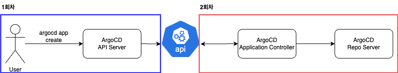
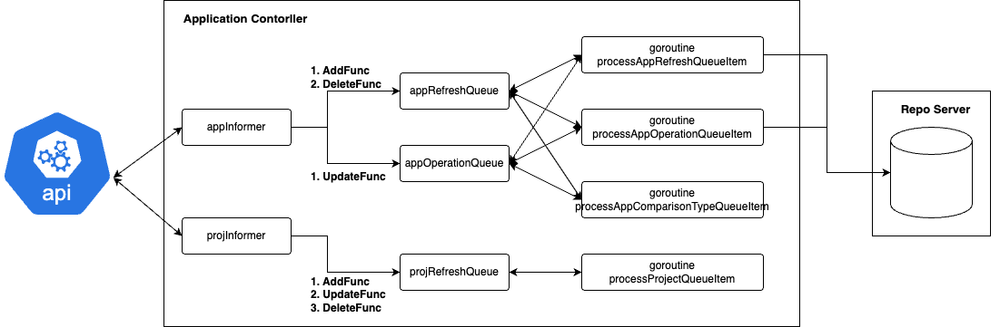
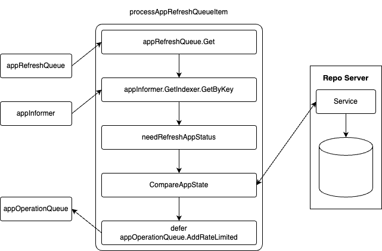

# 2401 ArgoCD 코드분석 02회차

## 2회차 목표
* Informer에서 Application의 Event에 따라 어떻게 처리 되는지 확인.
* Application Controller와 RepoServer와의 상호작용 지점 확인.

## 1회차 진행 내용 & 2회차 진행 예정 내용
* 1회차에서는 argocd app create를 생성했을때 api server에서 request를 어떻게 처리하는지 확인.
* 1회차 마지막에 application controller가 어떻게 생성된 application과 상호작용 하는지 간략하게 확인함.
* 2회차에서는 해당 상호작용에 대해 좀 더 자세하게 코드를 확인할 예정.
* 2회차에서 확인할 argo-cd 구성요소는 application-controller, repo server.



## 1. application controller

이번 스터디에서 확인할 Application Controller의 내용은 위의 그림과 같음.\
appInformer, projInformer를 통해 kube-api-server와 상호작용.\
각각 Informer는 create, update, delete에 따라 controller 내부의 queue에 Object Key를 발행.\
goroutine으로 돌고 있는 process method에서 queue에서 가져온 Objet Key 기반으로 로직 수행. \
이 중 processAppRefreshQueueItem, processAppOperationQueueItem은 RepoServer와 통신해서 생성/변경된 Source의 내용을 관리.

### [1.1 ApplicationController struct](https://github.com/argoproj/argo-cd/blob/v2.13.2/controller/appcontroller.go#L111)
```golang
type ApplicationController struct {
	...
	// queue contains app namespace/name
	appRefreshQueue workqueue.TypedRateLimitingInterface[string]
	// queue contains app namespace/name/comparisonType and used to request app refresh with the predefined comparison type
	appComparisonTypeRefreshQueue workqueue.TypedRateLimitingInterface[string]
	appOperationQueue             workqueue.TypedRateLimitingInterface[string]
	projectRefreshQueue           workqueue.TypedRateLimitingInterface[string]
	appInformer                   cache.SharedIndexInformer
	appLister                     applisters.ApplicationLister
	projInformer                  cache.SharedIndexInformer
	appStateManager               AppStateManager
	...
}
```
application controller가 가지는 멤버변수들을 확인해보면 app과 관련된 WorkQueue, ProjectQueue를 보유.\
application controller의 책임은 app, proj의 상태 관리임을 알 수 있음.

### [1.2 NewApplicationController Function call stack](https://github.com/argoproj/argo-cd/blob/v2.13.2/controller/appcontroller.go#L152)
```shell
NewApplicationController
|- db := db.NewDB(namespace, settingsMgr, kubeClientset)
|
|- kubectl.SetOnKubectlRun(ctrl.onKubectlRun)
|
|- * appInformer, appLister := ctrl.newApplicationInformerAndLister()
|
|- * projInformer := v1alpha1.NewAppProjectInformer(applicationClientset, namespace, appResyncPeriod, indexers)
|
|- factory := informers.NewSharedInformerFactoryWithOptions(ctrl.kubeClientset, defaultDeploymentInformerResyncDuration, informers.WithNamespace(settingsMgr.GetNamespace()))
|
|- ctrl.metricsServer, err = metrics.NewMetricsServer(metricsAddr, appLister, ctrl.canProcessApp, readinessHealthCheck, metricsApplicationLabels, metricsApplicationConditions)
|
|- stateCache := statecache.NewLiveStateCache(db, appInformer, ctrl.settingsMgr, kubectl, ctrl.metricsServer, ctrl.handleObjectUpdated, clusterSharding, argo.NewResourceTracking())
|
|- appStateManager := NewAppStateManager(db, applicationClientset, repoClientset, namespace, kubectl, ctrl.settingsMgr, stateCache, projInformer, ctrl.metricsServer, argoCache, ctrl.statusRefreshTimeout, argo.NewResourceTracking(), persistResourceHealth, repoErrorGracePeriod, serverSideDiff, ignoreNormalizerOpts)
```

### [1.2.1 appInformer](https://github.com/argoproj/argo-cd/blob/v2.13.2/controller/appcontroller.go#L2272)
```golang
_, err := informer.AddEventHandler(
	cache.ResourceEventHandlerFuncs{
		AddFunc: func(obj interface{}) {
			...
			key, err := cache.MetaNamespaceKeyFunc(obj)
			if err == nil {
				ctrl.appRefreshQueue.AddRateLimited(key)
			}
			...
		},
		UpdateFunc: func(old, new interface{}) {
			key, err := cache.MetaNamespaceKeyFunc(new)
			if err != nil {
				return
			}
			...
			ctrl.requestAppRefresh(newApp.QualifiedName(), compareWith, delay)
			if !newOK || (delay != nil && *delay != time.Duration(0)) {
				ctrl.appOperationQueue.AddRateLimited(key)
			}
			...
		},
		DeleteFunc: func(obj interface{}) {
			if !ctrl.canProcessApp(obj) {
				return
			}
			// IndexerInformer uses a delta queue, therefore for deletes we have to use this
			// key function.
			key, err := cache.DeletionHandlingMetaNamespaceKeyFunc(obj)
			if err == nil {
				// for deletes, we immediately add to the refresh queue
				ctrl.appRefreshQueue.Add(key)
			}
			...
		},
	},
)
```

appInformer EventHandler 등록과정을 보면 각각의 function이 다른 queue에 application의 key를 발행하고 있음.

* AddFunc의 경우 `appRefreshQueue`
* UpdateFunc의 경우 `appOperationQueue`
* DeleteFunc의 경우 `appRefreshQueue`

위와 같이 AddFunc, DeleteFunc은 `appRefreshQueue`로 UpdateFunc은 `appOperationQueue`로 object.key를 발행하는것 확인.

즉 argo app create를 해서 kube-api-server가 해당 crd를 생성하면 \
application controller의 informer는 AddFunc의 등록된 appRefreshqueue로 key를 발행하는것 확인 가능.


### [1.2.2 projInformer](https://github.com/argoproj/argo-cd/blob/v2.13.2/controller/appcontroller.go#L221)
```golang
_, err = projInformer.AddEventHandler(cache.ResourceEventHandlerFuncs{
	AddFunc: func(obj interface{}) {
		if key, err := cache.MetaNamespaceKeyFunc(obj); err == nil {
			ctrl.projectRefreshQueue.AddRateLimited(key)
			if projMeta, ok := obj.(metav1.Object); ok {
				ctrl.InvalidateProjectsCache(projMeta.GetName())
			}
		}
	},
	UpdateFunc: func(old, new interface{}) {
		if key, err := cache.MetaNamespaceKeyFunc(new); err == nil {
			ctrl.projectRefreshQueue.AddRateLimited(key)
			if projMeta, ok := new.(metav1.Object); ok {
				ctrl.InvalidateProjectsCache(projMeta.GetName())
			}
		}
	},
	DeleteFunc: func(obj interface{}) {
		if key, err := cache.DeletionHandlingMetaNamespaceKeyFunc(obj); err == nil {
			// immediately push to queue for deletes
			ctrl.projectRefreshQueue.Add(key)
			if projMeta, ok := obj.(metav1.Object); ok {
				ctrl.InvalidateProjectsCache(projMeta.GetName())
			}
		}
	},
})
```
projInformer의 EventHandler 등록과정을 보면 appInformer와 다르게 단일 `projectRefreshQueue`로 처리하는 것 확인 가능.

### [1.3 Run Method call stack](https://github.com/argoproj/argo-cd/blob/v2.13.2/controller/appcontroller.go#L836)
```shell
Run
|- go ctrl.appInformer.Run(ctx.Done())
|
|- go ctrl.projInformer.Run(ctx.Done())
|
|- go wait.Until(func() { for ctrl.processAppRefreshQueueItem() {}}, time.Second, ctx.Done())
								   |
								   |- ctrl.appInformer.GetIndexer().GetByKey(appKey)
								   |
								   |- ctrl.needRefreshAppStatus(origApp, ...)
								   |
								   		   |- IsRefreshRequested()
								   |
								   |- ctrl.refreshAppConditions(app)
								   |
								   |- ctrl.appStateManager.CompareAppState(app, ...)
|
|- go wait.Until(func() { for ctrl.processAppOperationQueueItem() {}}, time.Second, ctx.Done())
								   |
								   |- ctrl.appInformer.GetIndexer().GetByKey(appKey)
								   |
								   |- if app.Operation != nil { ArgoprojV1alpha1().Applications(...).Get(...) }
								   |
								   |- if app.Operation != nil { ctrl.processRequestedAppOperation(app) } else if ...
|
|- go wait.Until(func() { for ctrl.processAppComparisonTypeQueueItem() {}}, time.Second, ctx.Done())
								   |
								   |- ctrl.appComparisonTypeRefreshQueue.Get()
								   |
								   |- if parts := strings.Split(key, "/"); len(parts) != 3 { ... } else { ctrl.requestAppRefresh(...) } 
|
|- go wait.Until(func() { for ctrl.processProjectQueueItem() {}}, time.Second, ctx.Done())
								   |
								   |- ctrl.projectRefreshQueue.Get()
								   |
								   |- ctrl.projInformer.GetIndexer().GetByKey(key)
```
ApplicationController의 Run Method를 호출했을때 다양한 로직들이 동시에 실행됨.\
그 중 유의깊게 봐야하는 부분은 app, proj를 관리하는 아래의 4개 method임. 
* `processAppRefreshQueueItem`
* `processAppOperationQueueItem`
* `processAppComparisonTypeQueueItem`
* `processProjectQueueItem`

2회차 스터디의 목표는 app이 kube-api-server에 등록된 이후 application controller가 어떻게 동작하는지 확인임.\
1.2.1을 상기해보면 appInformer에서 EventHandler 등록시 AddFunc이 RefreshQueue에 ObjectKey를 추가하는것 확인.\
즉 처음 app이 생성되면 application controller에서 제일 처음 `RefreshQueue`를 통해 로직을 수행하는것 확인 가능.

### [1.4 processAppRefreshQueueItem](https://github.com/argoproj/argo-cd/blob/v2.13.2/controller/appcontroller.go#L1541)
```golang
func (ctrl *ApplicationController) processAppRefreshQueueItem() (processNext bool) {
	...
	appKey, shutdown := ctrl.appRefreshQueue.Get()
	...
	defer func() {
		if r := recover(); r != nil {
			log.Errorf("Recovered from panic: %+v\n%s", r, debug.Stack())
		}
		// We want to have app operation update happen after the sync, so there's no race condition
		// and app updates not proceeding. See https://github.com/argoproj/argo-cd/issues/18500.
		ctrl.appOperationQueue.AddRateLimited(appKey)
		ctrl.appRefreshQueue.Done(appKey)
	}()
	obj, exists, err := ctrl.appInformer.GetIndexer().GetByKey(appKey)
	
	...
	
	origApp = origApp.DeepCopy()
	needRefresh, refreshType, comparisonLevel := ctrl.needRefreshAppStatus(origApp, ctrl.statusRefreshTimeout, ctrl.statusHardRefreshTimeout)

	...

	project, hasErrors := ctrl.refreshAppConditions(app)
	...

	var localManifests []string
	if opState := app.Status.OperationState; opState != nil && opState.Operation.Sync != nil {
		localManifests = opState.Operation.Sync.Manifests
	}

	...

	compareResult, err := ctrl.appStateManager.CompareAppState(app, project, revisions, sources,
		refreshType == appv1.RefreshTypeHard,
		comparisonLevel == CompareWithLatestForceResolve, localManifests, hasMultipleSources, false)
	ts.AddCheckpoint("compare_app_state_ms")

	...
	return
}
```
processAppRefreshQueueItem의 가장 핵심 부분은 크게 두가지로
* appStateManager의 CompareAppState를 호출해서 비교결과를 가져오는 부분
* defer를 통해 모든 로직 수행후 appOperationQueue에 추가하는 부분과 appRefreshQueue에 남아있는 key를 지우는 부분


processAppRefreshQueueItem은 위 그림과 같은 flow를 가짐.
1. appRefreshQueue에서 Object Key를 획득
2. 가져온 Key 기반으로 appInformer에서 Object 검색
3. CompareAppState에서 Repo Server와 통신하며 AppStateResult 생성
4. 모든 로직 수행후 appOperationQueue에 Object Key 발행

특히 CompareAppState에서 GetRepoObjs를 호출하는데 해당 Method가 Repo Server와 통신을 진행함.

## 2. AppStateManager
### [2.1 AppStateManager Interface](https://github.com/argoproj/argo-cd/blob/v2.13.2/controller/state.go#L70)
```golang
type AppStateManager interface {
	CompareAppState(app *v1alpha1.Application, project *v1alpha1.AppProject, revisions []string, sources []v1alpha1.ApplicationSource, noCache bool, noRevisionCache bool, localObjects []string, hasMultipleSources bool, rollback bool) (*comparisonResult, error)
	SyncAppState(app *v1alpha1.Application, state *v1alpha1.OperationState)
	GetRepoObjs(app *v1alpha1.Application, sources []v1alpha1.ApplicationSource, appLabelKey string, revisions []string, noCache, noRevisionCache, verifySignature bool, proj *v1alpha1.AppProject, rollback bool) ([]*unstructured.Unstructured, []*apiclient.ManifestResponse, bool, error)
}
```
Application Controller에서 ArgoCD의 Application State를 관리하는 주체는 AppStateManager임을 확인 할 수 있음.\
AppStateManager는 `CompareAppState`, `SyncAppState`, `GetRepoObjs` method를 가지고 있음.


### [2.2 AppStateManager Concreate Struct -  appStateManager](https://github.com/argoproj/argo-cd/blob/v2.13.2/controller/state.go#L103)
```go
type appStateManager struct {
	...
	projInformer          cache.SharedIndexInformer
	kubectl               kubeutil.Kubectl
	repoClientset         apiclient.Clientset
	liveStateCache        statecache.LiveStateCache
	cache                 *appstatecache.Cache
	...
}
```
AppStateManager 인터페이스의 구현체인 appStateManager의 맴버변수를 확인해보면 \
`projInformer`, `kubectl`, `repoClientset`, `liveStateCache`, `cache`등 \
여러 객체를 통해 다른 컴포넌트와 상호작용하며 State를 관리함을 알 수 있음.

### 2.3 method
#### [2.3.1 CompareAppState](https://github.com/argoproj/argo-cd/blob/v2.13.2/controller/state.go#L429)
```shell
CompareAppState
|- m.getComparisonSettings()
|
|- m.liveStateCache.GetClusterCache(app.Spec.Destination.Server)
|
|- * m.GetRepoObjs(app, ...) 
|
|- m.liveStateCache.GetClusterCache(app.Spec.Destination.Server)
|
|- DeduplicateTargetObjects(app.Spec.Destination.Namespace, ...)
|
|- m.liveStateCache.GetManagedLiveObjs(app, targetObjs)
|
|- filter out all resources which are not permitted in the application project
|
|- * sync.Reconcile(targetObjs, liveObjByKey, app.Spec.Destination.Namespace, infoProvider)
|
|- * argodiff.StateDiffs(reconciliation.Live, reconciliation.Target, diffConfig)
|
|- AppState Reconcil
```
CompareAppState에서는 현재 Application 등록된 Source정보를 기반으로 Manifest를 갱신.\
갱신된 Manifest 기반으로 Live와 비교해 Application Status를 변경하는 기능을 수행중.\
CompareAppState에서는 정말 Application의 상태만 갱신하기에 \
processAppRefreshQueueItem에서 CompareAppState 호출 이후 다시 processAppOperationQueueItem으로 Object Key 발행

#### [2.3.1.1 - sync.Reconcile](https://github.com/argoproj/gitops-engine/blob/master/pkg/sync/reconcile.go#L72)
```golang
func Reconcile(targetObjs []*unstructured.Unstructured, liveObjByKey map[kube.ResourceKey]*unstructured.Unstructured, namespace string, resInfo kubeutil.ResourceInfoProvider) ReconciliationResult {
	targetObjs, hooks := splitHooks(targetObjs)
	dedupLiveResources(targetObjs, liveObjByKey)

	managedLiveObj := make([]*unstructured.Unstructured, len(targetObjs))
	for i, obj := range targetObjs {
		gvk := obj.GroupVersionKind()

		ns := text.FirstNonEmpty(obj.GetNamespace(), namespace)

		namespaced, err := resInfo.IsNamespaced(gvk.GroupKind())
		unknownScope := err != nil

		var keysToCheck []kubeutil.ResourceKey
		// If we get an error, we don't know whether the resource is namespaced. So we need to check for both in the
		// live objects. If we don't check for both, then we risk missing the object and deleting it.
		if namespaced || unknownScope {
			keysToCheck = append(keysToCheck, kubeutil.NewResourceKey(gvk.Group, gvk.Kind, ns, obj.GetName()))
		}
		if !namespaced || unknownScope {
			keysToCheck = append(keysToCheck, kubeutil.NewResourceKey(gvk.Group, gvk.Kind, "", obj.GetName()))
		}

		found := false
		for _, key := range keysToCheck {
			if liveObj, ok := liveObjByKey[key]; ok {
				managedLiveObj[i] = liveObj
				delete(liveObjByKey, key)
				found = true
				break
			}
		}
		if !found {
			managedLiveObj[i] = nil
		}
	}

	for _, obj := range liveObjByKey {
		targetObjs = append(targetObjs, nil)
		managedLiveObj = append(managedLiveObj, obj)
	}
	return ReconciliationResult{
		Target: targetObjs,
		Hooks:  hooks,
		Live:   managedLiveObj,
	}
}
```
targetObjs와 liveObjs의 배열 길이를 같게 만드는데 해당 이유는 뒤쪽에서 diff를 이용해 갱신해야하는 부분을 생성할때 liveobj, targetobj를 맞추기 위해서임.
해당 gitops-engine에서 Reconcile로직을 수행하면 변경해야할 Object들만 추출하게 됨.

#### [2.3.1.2 - AppState Reconcil](https://github.com/argoproj/argo-cd/blob/v2.13.2/controller/state.go#L727)
```golang
for i, targetObj := range reconciliation.Target {
	liveObj := reconciliation.Live[i]
	obj := liveObj
	if obj == nil {
		obj = targetObj
	}
	if obj == nil {
		continue
	}
	gvk := obj.GroupVersionKind()

	isSelfReferencedObj := m.isSelfReferencedObj(liveObj, targetObj, app.GetName(), appLabelKey, trackingMethod, installationID)

	resState := v1alpha1.ResourceStatus{
		Namespace:       obj.GetNamespace(),
		Name:            obj.GetName(),
		Kind:            gvk.Kind,
		Version:         gvk.Version,
		Group:           gvk.Group,
		Hook:            isHook(obj),
		RequiresPruning: targetObj == nil && liveObj != nil && isSelfReferencedObj,
	}
	if targetObj != nil {
		resState.SyncWave = int64(syncwaves.Wave(targetObj))
	}

	var diffResult diff.DiffResult
	if i < len(diffResults.Diffs) {
		diffResult = diffResults.Diffs[i]
	} else {
		diffResult = diff.DiffResult{Modified: false, NormalizedLive: []byte("{}"), PredictedLive: []byte("{}")}
	}

	// For the case when a namespace is managed with `managedNamespaceMetadata` AND it has resource tracking
	// enabled (e.g. someone manually adds resource tracking labels or annotations), we need to do some
	// bookkeeping in order to ensure that it's not considered `OutOfSync` (since it does not exist in source
	// control).
	//
	// This is in addition to the bookkeeping we do (see `isManagedNamespace` and its references) to prevent said
	// namespace from being pruned.
	isManagedNs := isManagedNamespace(targetObj, app) && liveObj == nil

	if resState.Hook || ignore.Ignore(obj) || (targetObj != nil && hookutil.Skip(targetObj)) || !isSelfReferencedObj {
		// For resource hooks, skipped resources or objects that may have
		// been created by another controller with annotations copied from
		// the source object, don't store sync status, and do not affect
		// overall sync status
	} else if !isManagedNs && (diffResult.Modified || targetObj == nil || liveObj == nil) {
		// Set resource state to OutOfSync since one of the following is true:
		// * target and live resource are different
		// * target resource not defined and live resource is extra
		// * target resource present but live resource is missing
		resState.Status = v1alpha1.SyncStatusCodeOutOfSync
		// we ignore the status if the obj needs pruning AND we have the annotation
		needsPruning := targetObj == nil && liveObj != nil
		if !(needsPruning && resourceutil.HasAnnotationOption(obj, common.AnnotationCompareOptions, "IgnoreExtraneous")) {
			syncCode = v1alpha1.SyncStatusCodeOutOfSync
		}
	} else {
		resState.Status = v1alpha1.SyncStatusCodeSynced
	}
	// set unknown status to all resource that are not permitted in the app project
	isNamespaced, err := m.liveStateCache.IsNamespaced(app.Spec.Destination.Server, gvk.GroupKind())
	if !project.IsGroupKindPermitted(gvk.GroupKind(), isNamespaced && err == nil) {
		resState.Status = v1alpha1.SyncStatusCodeUnknown
	}

	if isNamespaced && obj.GetNamespace() == "" {
		conditions = append(conditions, v1alpha1.ApplicationCondition{Type: v1alpha1.ApplicationConditionInvalidSpecError, Message: fmt.Sprintf("Namespace for %s %s is missing.", obj.GetName(), gvk.String()), LastTransitionTime: &now})
	}

	// we can't say anything about the status if we were unable to get the target objects
	if failedToLoadObjs {
		resState.Status = v1alpha1.SyncStatusCodeUnknown
	}

	resourceVersion := ""
	if liveObj != nil {
		resourceVersion = liveObj.GetResourceVersion()
	}
	managedResources[i] = managedResource{
		Name:            resState.Name,
		Namespace:       resState.Namespace,
		Group:           resState.Group,
		Kind:            resState.Kind,
		Version:         resState.Version,
		Live:            liveObj,
		Target:          targetObj,
		Diff:            diffResult,
		Hook:            resState.Hook,
		ResourceVersion: resourceVersion,
	}
	resourceSummaries[i] = resState
}
```


#### [2.3.2 GetRepoObjs](https://github.com/argoproj/argo-cd/blob/v2.13.2/controller/state.go#L127)
```shell
GetRepoObjs
|- helmRepos, err := m.db.ListHelmRepositories(context.Background())
|
|- permittedHelmRepos, err := argo.GetPermittedRepos(proj, helmRepos)
|
|- helmRepositoryCredentials, err := m.db.GetAllHelmRepositoryCredentials(context.Background())
|
|- permittedHelmCredentials, err := argo.GetPermittedReposCredentials(proj, helmRepositoryCredentials)
|
|- enabledSourceTypes, err := m.settingsMgr.GetEnabledSourceTypes()
|
|- kustomizeSettings, err := m.settingsMgr.GetKustomizeSettings()
|
|- helmOptions, err := m.settingsMgr.GetHelmSettings()
|
|- installationID, err := m.settingsMgr.GetInstallationID()
|
|- serverVersion, apiResources, err := m.liveStateCache.GetVersionsInfo(app.Spec.Destination.Server)
|
|- * conn, repoClient, err := m.repoClientset.NewRepoServerClient()
|
|- refSources, err := argo.GetRefSources(context.Background(), sources, app.Spec.Project, m.db.GetRepository, revisions, rollback)
```
GetRepoObjs의 가장 중요한 점은 argo-cd의 컴포넌트 중 하나인 repo server와 통신하며 manifest를 생성.\
Repo Server에서는 생성된 Manifest를 PV 혹은 Ephemeral volume에 저장.