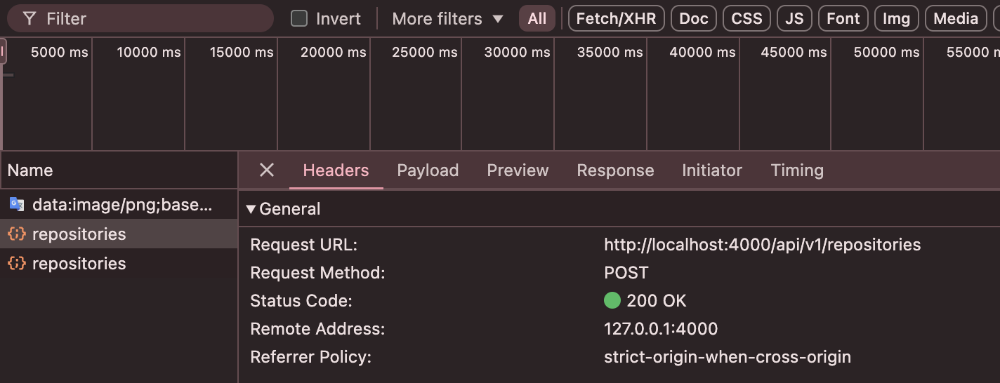
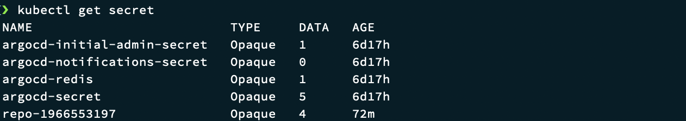
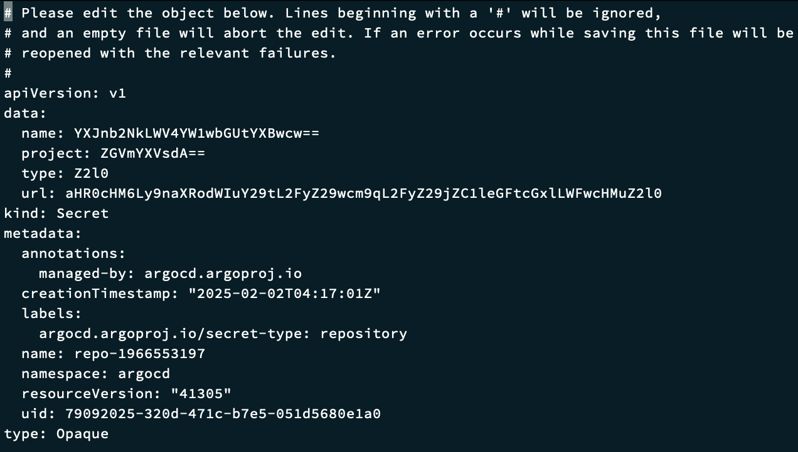
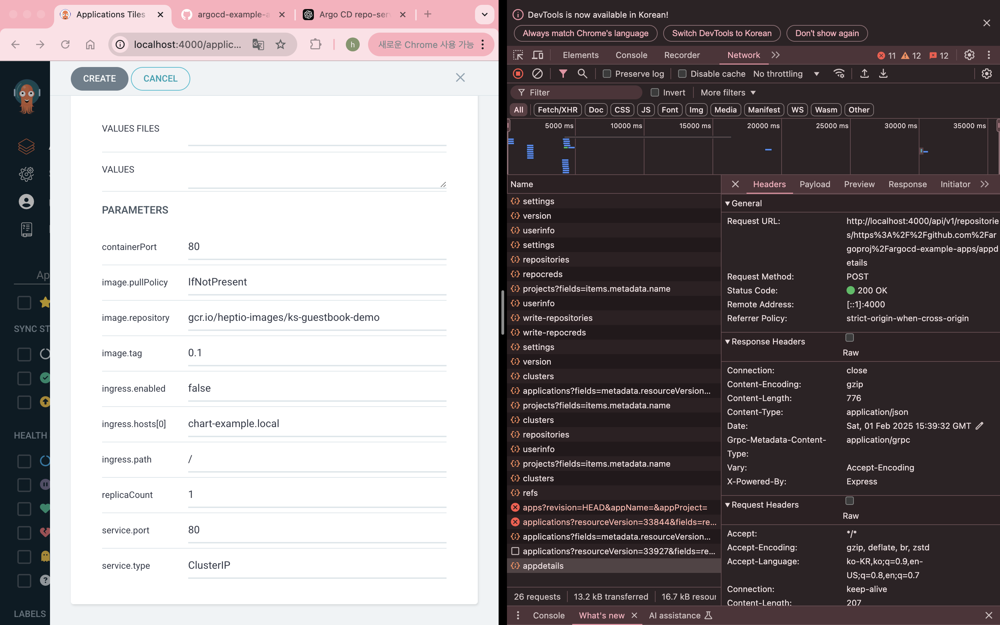
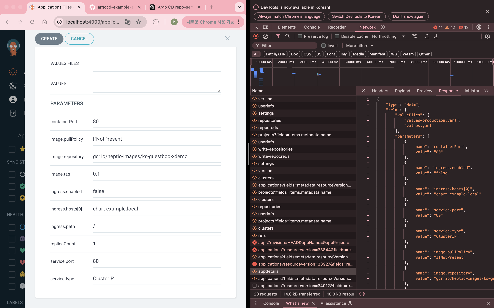
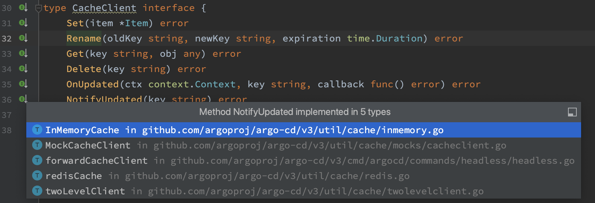

# 25202 ArgoCD 코드분석 04회차

## 4회차 목표
* repository 생성 후 흐름
* Application 생성 UI에서 헬름 차트 값 불러오는 원리

## repository 생성 후 흐름

UI에서 repository 생성 시 발생하는 request 값을 추적해보자


```go
// 🔗 server/repository/repository.proto
// CreateRepository creates a new repository configuration
rpc CreateRepository(RepoCreateRequest) returns (github.com.argoproj.argo_cd.v3.pkg.apis.application.v1alpha1.Repository) {
    option (google.api.http) = {
        post: "/api/v1/repositories"
        body: "repo"
    };
}
```

```go
// 🔗 server/repository/repository.go
// CreateRepository creates a repository configuration
func (s *Server) CreateRepository(ctx context.Context, q *repositorypkg.RepoCreateRequest) (*v1alpha1.Repository, error) {
	if q.Repo == nil {
		return nil, status.Errorf(codes.InvalidArgument, "missing payload in request")
	}

    // 📌 레파지토리 생성 권한 체크
	if err := s.enf.EnforceErr(ctx.Value("claims"), rbacpolicy.ResourceRepositories, rbacpolicy.ActionCreate, createRBACObject(q.Repo.Project, q.Repo.Repo)); err != nil {
		return nil, err
	}

	var repo *v1alpha1.Repository
	var err error

	//check we can connect to the repo, copying any existing creds (not supported for project scoped repositories)
    // 📌 프로젝트가 빈 값일 경우에 한하여 해당 레포에 관련된 이미 존재하는 creds가 있다면 복사한다.
    // 📌 프로젝트가 빈 값일 경우에 한하여 진행되는 이유는 creds가 전역 인증정보를 가져오기 떄문
	if q.Repo.Project == "" {
		repo := q.Repo.DeepCopy()
		if !repo.HasCredentials() {
			creds, err := s.db.GetRepositoryCredentials(ctx, repo.Repo)
			if err != nil {
				return nil, err
			}
			repo.CopyCredentialsFrom(creds)
		}

		err = s.testRepo(ctx, repo)
		if err != nil {
			return nil, err
		}
	}

	r := q.Repo
	r.ConnectionState = v1alpha1.ConnectionState{Status: v1alpha1.ConnectionStatusSuccessful}
    // 📌 CreateRepository 로직 수행
	repo, err = s.db.CreateRepository(ctx, r)
	if status.Convert(err).Code() == codes.AlreadyExists {
		// act idempotent if existing spec matches new spec
		existing, getErr := s.db.GetRepository(ctx, r.Repo, q.Repo.Project)
		if getErr != nil {
			return nil, status.Errorf(codes.Internal, "unable to check existing repository details: %v", getErr)
		}

		existing.Type = text.FirstNonEmpty(existing.Type, "git")
		// repository ConnectionState may differ, so make consistent before testing
		existing.ConnectionState = r.ConnectionState
		switch {
		case reflect.DeepEqual(existing, r):
			repo, err = existing, nil
		case q.Upsert:
			r.Project = q.Repo.Project
			return s.db.UpdateRepository(ctx, r)
		default:
			return nil, status.Error(codes.InvalidArgument, argo.GenerateSpecIsDifferentErrorMessage("repository", existing, r))
		}
	}
	if err != nil {
		return nil, err
	}
	return &v1alpha1.Repository{Repo: repo.Repo, Type: repo.Type, Name: repo.Name}, nil
}
```

```go
// 🔗 util/db/repository.go
func (db *db) CreateRepository(ctx context.Context, r *v1alpha1.Repository) (*v1alpha1.Repository, error) {
    // 📌 현재 기본 디비는 secretBackend를 사용하고 legacy가 공존하는것으로 보임
	secretBackend := db.repoBackend()
	legacyBackend := db.legacyRepoBackend()

	secretExists, err := secretBackend.RepositoryExists(ctx, r.Repo, r.Project, false)
	if err != nil {
		return nil, err
	}
	legacyExists, err := legacyBackend.RepositoryExists(ctx, r.Repo, r.Project, false)
	if err != nil {
		return nil, err
	}

	if secretExists || legacyExists {
		return nil, status.Errorf(codes.AlreadyExists, "repository %q already exists", r.Repo)
	}

    // 📌 최종적으로 secretBackend를 통해 CreateRepository 함수 호출
	return secretBackend.CreateRepository(ctx, r)
}
```

```go
// 🔗 util/db/repository_secrets.go
func (s *secretsRepositoryBackend) CreateRepository(ctx context.Context, repository *appsv1.Repository) (*appsv1.Repository, error) {
	secName := RepoURLToSecretName(repoSecretPrefix, repository.Repo, repository.Project)

	repositorySecret := &corev1.Secret{
		ObjectMeta: metav1.ObjectMeta{
			Name: secName,
		},
	}

	s.repositoryToSecret(repository, repositorySecret)

    // 📌 createSecret 함수 호출
	_, err := s.db.createSecret(ctx, repositorySecret)
	if err != nil {
		if apierrors.IsAlreadyExists(err) {
			hasLabel, err := s.hasRepoTypeLabel(secName)
			if err != nil {
				return nil, status.Error(codes.Internal, err.Error())
			}
			if !hasLabel {
				msg := fmt.Sprintf("secret %q doesn't have the proper %q label: please fix the secret or delete it", secName, common.LabelKeySecretType)
				return nil, status.Error(codes.InvalidArgument, msg)
			}
			return nil, status.Errorf(codes.AlreadyExists, "repository %q already exists", repository.Repo)
		}
		return nil, err
	}

	return repository, s.db.settingsMgr.ResyncInformers()
}
```

```go
// 🔗 util/db/secrets.go
func (db *db) createSecret(ctx context.Context, secret *corev1.Secret) (*corev1.Secret, error) {
    // 📌 결국 kubernetes를 통해 repository 정보를 담은 secret 생성
	return db.kubeclientset.CoreV1().Secrets(db.ns).Create(ctx, secret, metav1.CreateOptions{})
}
```

아래와 같이 repository에 관련된 secret이 생성된 것을 볼 수 있음




## Application 생성 UI에서 헬름 차트 값 불러오는 원리

Application 생성 UI에서 repository를 선택하고 chart가 존재하는 path를 입력하면 자동으로 해당 차트가 가지고있는 values.yaml을 파싱하여 보여준다.




확인 결과 /appdetails 요청을 통해 값을 가져와 보여주고 있다.
```go
// 🔗 server/repository/repository.proto
// GetAppDetails returns application details by given path
rpc GetAppDetails(RepoAppDetailsQuery) returns (repository.RepoAppDetailsResponse) {
    option (google.api.http) = {
        post: "/api/v1/repositories/{source.repoURL}/appdetails"
        body: "*"
    };
}
```

```go
// 🔗 reposerver/repository/repository.go
func (s *Service) GetAppDetails(ctx context.Context, q *apiclient.RepoServerAppDetailsQuery) (*apiclient.RepoAppDetailsResponse, error) {
	res := &apiclient.RepoAppDetailsResponse{}

	cacheFn := s.createGetAppDetailsCacheHandler(res, q)
	operation := func(repoRoot, commitSHA, revision string, ctxSrc operationContextSrc) error {
		opContext, err := ctxSrc()
		if err != nil {
			return err
		}

		env := newEnvRepoQuery(q, revision)

		appSourceType, err := GetAppSourceType(ctx, q.Source, opContext.appPath, repoRoot, q.AppName, q.EnabledSourceTypes, s.initConstants.CMPTarExcludedGlobs, env.Environ())
		if err != nil {
			return err
		}

		res.Type = string(appSourceType)

		switch appSourceType {
		case v1alpha1.ApplicationSourceTypeHelm:
			if err := populateHelmAppDetails(res, opContext.appPath, repoRoot, q, s.gitRepoPaths); err != nil {
				return err
			}
		case v1alpha1.ApplicationSourceTypeKustomize:
			if err := populateKustomizeAppDetails(res, q, repoRoot, opContext.appPath, commitSHA, s.gitCredsStore); err != nil {
				return err
			}
		case v1alpha1.ApplicationSourceTypePlugin:
			if err := populatePluginAppDetails(ctx, res, opContext.appPath, repoRoot, q, s.initConstants.CMPTarExcludedGlobs); err != nil {
				return fmt.Errorf("failed to populate plugin app details: %w", err)
			}
		}
        // 📌 git 저장소에서 가져온 정보를 캐시에 저장하여 이후 동일한 요청이 들어오면 재사용할 수 있도록 함
		_ = s.cache.SetAppDetails(revision, q.Source, q.RefSources, res, v1alpha1.TrackingMethod(q.TrackingMethod), nil)
		return nil
	}

	settings := operationSettings{allowConcurrent: q.Source.AllowsConcurrentProcessing(), noCache: q.NoCache, noRevisionCache: q.NoCache || q.NoRevisionCache}
	err := s.runRepoOperation(ctx, q.Source.TargetRevision, q.Repo, q.Source, false, cacheFn, operation, settings, len(q.RefSources) > 0, q.RefSources)

	return res, err
}
```

```go
// 🔗 reposerver/cache/cache.go
func (c *Cache) GetAppDetails(revision string, appSrc *appv1.ApplicationSource, srcRefs appv1.RefTargetRevisionMapping, res *apiclient.RepoAppDetailsResponse, trackingMethod appv1.TrackingMethod, refSourceCommitSHAs ResolvedRevisions) error {
	return c.cache.GetItem(appDetailsCacheKey(revision, appSrc, srcRefs, trackingMethod, refSourceCommitSHAs), res)
}
```

```go
// 🔗 reposerver/cache/cache.go
func appDetailsCacheKey(revision string, appSrc *appv1.ApplicationSource, srcRefs appv1.RefTargetRevisionMapping, trackingMethod appv1.TrackingMethod, refSourceCommitSHAs ResolvedRevisions) string {
	if trackingMethod == "" {
		trackingMethod = argo.TrackingMethodLabel
	}
	return fmt.Sprintf("appdetails|%s|%d|%s", revision, appSourceKey(appSrc, srcRefs, refSourceCommitSHAs), trackingMethod)
}
```

```go
// 🔗 util/cache/cache.go
func (c *Cache) GetItem(key string, item any) error {
	key = c.generateFullKey(key)
	if item == nil {
		return fmt.Errorf("cannot get item into a nil for key %s", key)
	}
	client := c.GetClient()
	return client.Get(key, item)
}
```


```go
// 🔗 reposerver/repository/repository.go
// runRepoOperation downloads either git folder or helm chart and executes specified operation
// - Returns a value from the cache if present (by calling getCached(...)); if no value is present, the
// provide operation(...) is called. The specific return type of this function is determined by the
// calling function, via the provided  getCached(...) and operation(...) function.
func (s *Service) runRepoOperation(
	ctx context.Context,
	revision string,
	repo *v1alpha1.Repository,
	source *v1alpha1.ApplicationSource,
	verifyCommit bool,
	cacheFn func(cacheKey string, refSourceCommitSHAs cache.ResolvedRevisions, firstInvocation bool) (bool, error),
	operation func(repoRoot, commitSHA, cacheKey string, ctxSrc operationContextSrc) error,
	settings operationSettings,
	hasMultipleSources bool,
	refSources map[string]*v1alpha1.RefTarget,
) error {
	if sanitizer, ok := grpc.SanitizerFromContext(ctx); ok {
		// make sure a randomized path replaced with '.' in the error message
		sanitizer.AddRegexReplacement(getRepoSanitizerRegex(s.rootDir), "<path to cached source>")
	}

	var gitClient git.Client
	var helmClient helm.Client
	var err error
	gitClientOpts := git.WithCache(s.cache, !settings.noRevisionCache && !settings.noCache)
	revision = textutils.FirstNonEmpty(revision, source.TargetRevision)
	unresolvedRevision := revision
	if source.IsHelm() {
		helmClient, revision, err = s.newHelmClientResolveRevision(repo, revision, source.Chart, settings.noCache || settings.noRevisionCache)
		if err != nil {
			return err
		}
	} else {
		gitClient, revision, err = s.newClientResolveRevision(repo, revision, gitClientOpts)
		if err != nil {
			return err
		}
	}

	repoRefs, err := resolveReferencedSources(hasMultipleSources, source.Helm, refSources, s.newClientResolveRevision, gitClientOpts)
	if err != nil {
		return err
	}

	if !settings.noCache {
		if ok, err := cacheFn(revision, repoRefs, true); ok {
			return err
		}
	}

	s.metricsServer.IncPendingRepoRequest(repo.Repo)
	defer s.metricsServer.DecPendingRepoRequest(repo.Repo)

	if settings.sem != nil {
		err = settings.sem.Acquire(ctx, 1)
		if err != nil {
			return err
		}
		defer settings.sem.Release(1)
	}

	if source.IsHelm() {
		if settings.noCache {
			err = helmClient.CleanChartCache(source.Chart, revision, repo.Project)
			if err != nil {
				return err
			}
		}
		helmPassCredentials := false
		if source.Helm != nil {
			helmPassCredentials = source.Helm.PassCredentials
		}
		chartPath, closer, err := helmClient.ExtractChart(source.Chart, revision, repo.Project, helmPassCredentials, s.initConstants.HelmManifestMaxExtractedSize, s.initConstants.DisableHelmManifestMaxExtractedSize)
		if err != nil {
			return err
		}
		defer io.Close(closer)
		if !s.initConstants.AllowOutOfBoundsSymlinks {
			err := apppathutil.CheckOutOfBoundsSymlinks(chartPath)
			if err != nil {
				oobError := &apppathutil.OutOfBoundsSymlinkError{}
				if errors.As(err, &oobError) {
					log.WithFields(log.Fields{
						common.SecurityField: common.SecurityHigh,
						"chart":              source.Chart,
						"revision":           revision,
						"file":               oobError.File,
					}).Warn("chart contains out-of-bounds symlink")
					return fmt.Errorf("chart contains out-of-bounds symlinks. file: %s", oobError.File)
				}
				return err
			}
		}
		return operation(chartPath, revision, revision, func() (*operationContext, error) {
			return &operationContext{chartPath, ""}, nil
		})
	}
	closer, err := s.repoLock.Lock(gitClient.Root(), revision, settings.allowConcurrent, func() (goio.Closer, error) {
		return s.checkoutRevision(gitClient, revision, s.initConstants.SubmoduleEnabled)
	})
	if err != nil {
		return err
	}

	defer io.Close(closer)

	if !s.initConstants.AllowOutOfBoundsSymlinks {
		err := apppathutil.CheckOutOfBoundsSymlinks(gitClient.Root())
		if err != nil {
			oobError := &apppathutil.OutOfBoundsSymlinkError{}
			if errors.As(err, &oobError) {
				log.WithFields(log.Fields{
					common.SecurityField: common.SecurityHigh,
					"repo":               repo.Repo,
					"revision":           revision,
					"file":               oobError.File,
				}).Warn("repository contains out-of-bounds symlink")
				return fmt.Errorf("repository contains out-of-bounds symlinks. file: %s", oobError.File)
			}
			return err
		}
	}

	var commitSHA string
	if hasMultipleSources {
		commitSHA = revision
	} else {
		commit, err := gitClient.CommitSHA()
		if err != nil {
			return fmt.Errorf("failed to get commit SHA: %w", err)
		}
		commitSHA = commit
	}

	// double-check locking
	if !settings.noCache {
		if ok, err := cacheFn(revision, repoRefs, false); ok {
			return err
		}
	}

	// Here commitSHA refers to the SHA of the actual commit, whereas revision refers to the branch/tag name etc
	// We use the commitSHA to generate manifests and store them in cache, and revision to retrieve them from cache
	return operation(gitClient.Root(), commitSHA, revision, func() (*operationContext, error) {
		var signature string
		if verifyCommit {
			// When the revision is an annotated tag, we need to pass the unresolved revision (i.e. the tag name)
			// to the verification routine. For everything else, we work with the SHA that the target revision is
			// pointing to (i.e. the resolved revision).
			var rev string
			if gitClient.IsAnnotatedTag(revision) {
				rev = unresolvedRevision
			} else {
				rev = revision
			}
			signature, err = gitClient.VerifyCommitSignature(rev)
			if err != nil {
				return nil, err
			}
		}
		appPath, err := apppathutil.Path(gitClient.Root(), source.Path)
		if err != nil {
			return nil, err
		}
		return &operationContext{appPath, signature}, nil
	})
}
```

```go
// 🔗 reposerver/repository/repository.go
func populateHelmAppDetails(res *apiclient.RepoAppDetailsResponse, appPath string, repoRoot string, q *apiclient.RepoServerAppDetailsQuery, gitRepoPaths io.TempPaths) error {
	var selectedValueFiles []string
	var availableValueFiles []string

	if q.Source.Helm != nil {
		selectedValueFiles = q.Source.Helm.ValueFiles
	}

	err := filepath.Walk(appPath, walkHelmValueFilesInPath(appPath, &availableValueFiles))
	if err != nil {
		return err
	}

	res.Helm = &apiclient.HelmAppSpec{ValueFiles: availableValueFiles}
	var version string
	var passCredentials bool
	if q.Source.Helm != nil {
		if q.Source.Helm.Version != "" {
			version = q.Source.Helm.Version
		}
		passCredentials = q.Source.Helm.PassCredentials
	}
	helmRepos, err := getHelmRepos(appPath, q.Repos, nil)
	if err != nil {
		return err
	}
	h, err := helm.NewHelmApp(appPath, helmRepos, false, version, q.Repo.Proxy, q.Repo.NoProxy, passCredentials)
	if err != nil {
		return err
	}
	defer h.Dispose()

	if resolvedValuesPath, _, err := pathutil.ResolveValueFilePathOrUrl(appPath, repoRoot, "values.yaml", []string{}); err == nil {
		if err := loadFileIntoIfExists(resolvedValuesPath, &res.Helm.Values); err != nil {
			return err
		}
	} else {
		log.Warnf("Values file %s is not allowed: %v", filepath.Join(appPath, "values.yaml"), err)
	}
	ignoreMissingValueFiles := false
	if q.Source.Helm != nil {
		ignoreMissingValueFiles = q.Source.Helm.IgnoreMissingValueFiles
	}
	resolvedSelectedValueFiles, err := getResolvedValueFiles(appPath, repoRoot, &v1alpha1.Env{}, q.GetValuesFileSchemes(), selectedValueFiles, q.RefSources, gitRepoPaths, ignoreMissingValueFiles)
	if err != nil {
		return fmt.Errorf("failed to resolve value files: %w", err)
	}
	params, err := h.GetParameters(resolvedSelectedValueFiles, appPath, repoRoot)
	if err != nil {
		return err
	}
	for k, v := range params {
		res.Helm.Parameters = append(res.Helm.Parameters, &v1alpha1.HelmParameter{
			Name:  k,
			Value: v,
		})
	}
	for _, v := range fileParameters(q) {
		res.Helm.FileParameters = append(res.Helm.FileParameters, &v1alpha1.HelmFileParameter{
			Name: v.Name,
			Path: v.Path, // filepath.Join(appPath, v.Path),
		})
	}
	return nil
}
```